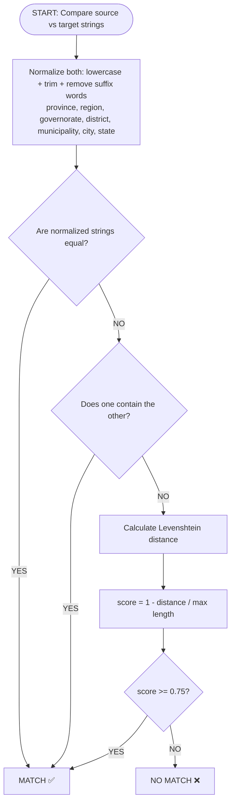

# TECHNICAL SPECIFICATION: Customer Location Map Picker
**Title**: POS, Web: Add Customer Location (Google Maps - Country, State auto detect)  
**Status**: Implementation Complete — Pending Test & Review  
**Branch**: mubashir-dev  

---

## 1. Task Overview
The goal of this task is to integrate an interactive **"Pick on Map"** feature inside the POS **Add New Customer** form. This allows cashiers to search for locations using Google Places autocomplete or drag a map pin to pinpoint the customer's coordinates. Once confirmed, the map geocodes the coordinates and auto-fills all related address fields (Country, State, District/City, Pincode, and Street Address) in the form, matching them against the local backend database.

---

## 2. User Flow
1. **Initiate Form**: The cashier is on the checkout payment/finalize order screen and opens the **"+ Add New Customer"** modal (rendered via [custom_customer_form.dart](file:///c:/Users/Mubashir/eposmob/lib/newcomponents/custom_customer_form.dart)).
2. **Trigger Location Picker**: Tapping the **"Pick on Map"** button next to the **Street Address** label triggers the map modal dialog.
3. **Map Initialization**: 
   * The app checks and requests GPS permissions. 
   * If GPS is enabled and permissions are granted, the map defaults to the cashier's current coordinates.
   * If GPS is denied or unavailable, the map falls back to a global world view (lat 0, lng 0) allowing free search.
4. **Interactive Pinpoint**: The cashier types an address in the search box (supported by autocomplete suggestions) or drags the map marker to a specific location.
5. **Real-time Feedback**: The geocoded address updates live in a green info box at the bottom of the map dialog.
6. **Confirm & Auto-fill**: Tapping **"Confirm Location"** pops the dialog, returns the geolocation result, and initiates a cascading matching sequence to automatically populate Country, State, District, Pincode, and Street Address inputs.

---

## 3. Feature Flow Diagram

### Figure 1: Complete Feature Flow

```mermaid
flowchart TD
    START([START: Cashier opens Add New Customer form]) --> TapButton[Cashier taps Pick on Map button]
    
    TapButton --> GPSPermission{GPS Permission Granted?}
    GPSPermission -- YES --> GetCoords[Get device coordinates] --> CenterGPS[Center map on GPS location]
    GPSPermission -- NO --> CenterWorld[Open map at world view lat 0, lng 0]
    
    CenterGPS --> DialogOpen[Location Picker Dialog Opens<br/>Search box + Interactive map + Draggable pin]
    CenterWorld --> DialogOpen
    
    DialogOpen --> SelectLocation{How does cashier select location?}
    
    SelectLocation -- SEARCH --> SearchInput[Types address] --> Autocomplete[Places Autocomplete suggestions appear] --> SelectSug[Selects suggestion] --> MovePinSearch[Pin moves to location]
    SelectLocation -- TAP MAP --> TapMap[Taps on map] --> MovePinTap[Pin moves to tapped location]
    SelectLocation -- DRAG PIN --> DragPin[Drags pin to location]
    
    MovePinSearch --> GeocodeCall[Geocoding API called]
    MovePinTap --> GeocodeCall
    DragPin --> GeocodeCall
    
    GeocodeCall --> ExtractData[Extracts: formatted_address, country, state, city,<br/>pincode, place_id, landmark, latitude, longitude]
    ExtractData --> UpdateInfo[Green info box updates with detected address]
    
    UpdateInfo --> ConfirmLoc{Cashier satisfied with location?}
    ConfirmLoc -- NO --> SelectLocation
    ConfirmLoc -- YES --> TapConfirm[Taps Confirm Location button]
    
    TapConfirm --> CloseDialog[Dialog closes] --> AutofillTrigger[_autoFillFromLocation trigger]
    
    AutofillTrigger --> FreeTextFill[Always fills immediately:<br/>countryTextController = result.country<br/>streetAddressTextController = result.formattedAddress]
    
    FreeTextFill --> FuzzyState{Fuzzy Match: Does result.state match any entry in backend stateList?}
    FuzzyState -- NO MATCH --> StateEmpty[State dropdown stays empty<br/>Cashier selects manually] --> DistrictPincodeEmpty[District + Pincode also stay empty] --> EndCascade[All matched fields now auto-selected in form dropdowns]
    FuzzyState -- MATCH --> SetState[selectedStateId set] --> RebuildState[stateDropdownKey rebuilt] --> LoadDistricts[await listAllDistricts called]
    
    LoadDistricts --> FuzzyDistrict{Fuzzy Match: Does result.city match any entry in backend districtList?}
    FuzzyDistrict -- NO MATCH --> DistrictEmpty[District dropdown stays empty] --> PincodeEmpty[Pincode also stays empty] --> EndCascade
    FuzzyDistrict -- MATCH --> SetDistrict[selectedDistrictId set] --> RebuildDistrict[districtDropdownKey rebuilt] --> LoadPincodes[await listAllPincodes called]
    
    LoadPincodes --> FuzzyPincode{Fuzzy Match: Does result.pincode match any entry in backend pincodeList?}
    FuzzyPincode -- NO MATCH --> PincodeEmpty2[Pincode dropdown stays empty] --> EndCascade
    FuzzyPincode -- MATCH --> SetPincode[selectedPincodeId set] --> RebuildPincode[pincodeDropdownKey rebuilt] --> EndCascade
    
    EndCascade --> SaveCustomer[END: Cashier completes remaining fields and submits]
```


### Figure 2: Fuzzy Matching Algorithm


> **Note**: Diagrams rendered using Mermaid. View on GitHub or any Mermaid-compatible markdown viewer.

---

## 4. Platform Support & Technical Decision
The `eposmob` application is cross-platform, compiled for **Windows (MSIX)**, **Android (APK)**, and **Linux**.

### The WebView-Based Map Approach (Option A)
The senior developer (Gokul) approved **Option A** — using a local WebView-based Google Map picker instead of native widgets:
* **Why `google_maps_flutter` was NOT used**: The official native maps plugin lacks support for Windows desktop and Linux.
* **Consistency**: Loading a shared HTML/JS asset in a WebView provides a identical, unified map interface across all platforms.
* **WebView Plugins Used**: 
  * Android: `webview_flutter` + `webview_flutter_android`
  * Windows: `webview_windows` (Microsoft Edge WebView2 runtime)
* **Linux Limitation**: WebView support on Linux under Flutter is unstable. For Linux targets, this is a known limitation. Cashiers on Linux will input details manually.

---

## 5. Google Cloud APIs Required
Since the map runs inside a JS WebView, native mobile SDKs are bypassed. Instead, the following API profiles must be enabled on the Google Cloud project (under a billed account):
1. **Maps JavaScript API**: Renders the interactive map canvas and handle marker dragging/clicks inside the WebView.
2. **Places API**: Drives the search autocomplete suggestion box inside the WebView.
3. **Geocoding API**: Resolves coordinates (lat/lng) into structured address objects (postal code, administrative areas, country) upon pin movements.

---

## 6. Environment & API Key Setup
To maintain security and prevent hardcoding key credentials:
* **Storage**: The API key is stored locally in a `.env` file (`GOOGLE_MAPS_API_KEY=AIzaSy...`) in the project root.
* **Git Protection**: `.env` is registered in both the root [.gitignore](file:///c:/Users/Mubashir/eposmob/.gitignore#L60) and [windows/.gitignore](file:///c:/Users/Mubashir/eposmob/windows/.gitignore#L18).
* **Loading**: `flutter_dotenv` loads `.env` at startup. [main.dart](file:///c:/Users/Mubashir/eposmob/lib/main.dart#L133) calls `await dotenv.load(fileName: ".env")` inside `main()` before `runApp()`.
* **Injected Key**: The picker HTML is loaded as a string via `rootBundle.loadString()`. The placeholder token `GOOGLE_MAPS_API_KEY_PLACEHOLDER` in the HTML string is replaced with the loaded env key dynamically at runtime before loading the WebView.
* **CI/CD Build Pipeline**: For automated GitHub builds, the key is stored as a secret and injected using `--dart-define=GOOGLE_MAPS_API_KEY=${{ secrets.GOOGLE_MAPS_KEY }}` during build steps.

---

## 7. Changed and Created Files

### a) [pubspec.yaml](file:///c:/Users/Mubashir/eposmob/pubspec.yaml) (Modified)
* **Dependencies Added**:
  ```yaml
  webview_flutter: ^4.9.0
  webview_windows: ^0.4.0
  webview_flutter_android: ^4.1.0
  flutter_dotenv: ^5.1.0
  geolocator: ^13.0.0
  ```
* **Asset Directory & Env Registered**:
  ```yaml
  flutter:
    assets:
      - assets/html/
      - .env
  ```
* **Windows Packager Capabilities**: Added `location` capability under UWP `msix_config` so packaged Windows installers request device location services:
  ```yaml
  msix_config:
    capabilities: internetClient, bluetooth, location
  ```

### b) [main.dart](file:///c:/Users/Mubashir/eposmob/lib/main.dart) (Modified)
* Imported `flutter_dotenv` and configured environment loading at application startup:
  ```dart
  import 'package:flutter_dotenv/flutter_dotenv.dart';
  
  void main() async {
    WidgetsFlutterBinding.ensureInitialized();
    // ... other initializations
    await dotenv.load(fileName: ".env");
    runApp(const MyApp());
  }
  ```

### c) [AndroidManifest.xml](file:///c:/Users/Mubashir/eposmob/android/app/src/main/AndroidManifest.xml) (Modified)
* Added coarse and fine location permissions below the standard `INTERNET` permission:
  ```xml
  <uses-permission android:name="android.permission.ACCESS_FINE_LOCATION" />
  <uses-permission android:name="android.permission.ACCESS_COARSE_LOCATION" />
  ```

### d) [map_picker.html](file:///c:/Users/Mubashir/eposmob/assets/html/map_picker.html) (NEW)
* Stands as the shared WebView asset.
* Contains full-screen `div#map` and floating `input#search-box` with shadow styling.
* Reads coordinates passed by Flutter (injected as JS variables at load time) to center map or falls back to world view.
* Listens to map clicks, marker drags, and autocomplete selects to reverse-geocode addresses.
* Extracts structured parameters: `formatted_address`, `latitude`, `longitude`, `place_id`, `landmark`, `country`, `state`, `city`, `pincode`.
* Posts messages back to Flutter via platform-specific bridges:
  ```javascript
  function sendToFlutter(jsonString) {
    if (window.FlutterChannel) {
      window.FlutterChannel.postMessage(jsonString); // Android webview_flutter channel
    } else if (window.chrome && window.chrome.webview) {
      window.chrome.webview.postMessage(jsonString); // Windows webview_windows channel
    }
  }
  ```

### e) [location_picker_dialog.dart](file:///c:/Users/Mubashir/eposmob/lib/widgets/customer/location_picker_dialog.dart) (NEW)
* Declares `LocationResult` model mapping the 9 location fields.
* Prompts GPS location checks via `Geolocator` (requests permission, falls back gracefully on timeout).
* Performs string replacement in `map_picker.html` to inject the API key and initial GPS coords.
* Mounts targets conditionally:
  * On Windows: Spawns `webview_windows` controller, initializes Edge engine, and hooks into `webMessage` streams (loads data encoded URI).
  * On Android: Instantiates `webview_flutter` `WebViewController` with Javascript Channel `FlutterChannel` (loads HTML string directly).
* Displays a modern modal dialog featuring a title, 400px map area, live green address box, and Cancel/Confirm controls.

### f) [custom_customer_form.dart](file:///c:/Users/Mubashir/eposmob/lib/newcomponents/custom_customer_form.dart) (Modified)
* **Replaced Street Address Label**: The plain "Street Address" label is replaced with a `Row` containing:
  * Left side: "Street Address" label text (retaining existing font weight and color).
  * Right side: A `TextButton.icon` calling `_openLocationPicker()` on tap with:
    * `icon`: `Icons.location_pin` (size 14, color `Colors.blue`)
    * `label`: `Text("Pick on Map", style: TextStyle(fontSize: 12, color: Colors.blue))`
    * `padding`: Zeroed out (`EdgeInsets.zero`, `minimumSize: Size.zero`, `tapTargetSize: MaterialTapTargetSize.shrinkWrap`) to not distort row height.
* **New Imports Added**:
  ```dart
  import 'package:collection/collection.dart';
  import 'package:pos_machine/widgets/customer/location_picker_dialog.dart';
  ```
* **Dialog Trigger (`_openLocationPicker`)**: Shows the `LocationPickerDialog` modal using the Flutter `showDialog` wrapper, awaits the nullable `LocationResult`, and triggers autofill on confirmation:
  ```dart
  Future<void> _openLocationPicker() async {
    final result = await showDialog<LocationResult>(
      context: context,
      builder: (_) => const LocationPickerDialog(),
    );
    if (result != null && mounted) {
      await _autoFillFromLocation(result);
    }
  }
  ```
* **Fuzzy Autofill Cascade (`_autoFillFromLocation`)**: 
  Matches the geocoded location to the master databases sequentially:
  * **Step 1 (Immediate Free Text Fill)**: Instantly populates `countryTextController.text = result.country` and `streetAddressTextController.text = result.formattedAddress`.
  * **Step 2 (State Match)**: Search `locationProvider.stateList` for a fuzzy-matched State name using `_fuzzyMatch()`.
  * **Step 3 (Districts Query)**: If State matched, clears `selectedDistrictId` and `selectedPincodeId`. Triggers loading spinner (`isLoadingDistricts = true`), calls `await locationProvider.listAllDistricts(stateId: matchedState.key, accessToken: token)`, sets `isLoadingDistricts = false`, and updates dropdown view by generating a new `districtDropdownKey`.
  * **Step 4 (District Match)**: Search `locationProvider.districtList` for a fuzzy-matched City/District name.
  * **Step 5 (Pincodes Query)**: If District matched, clears `selectedPincodeId`. Triggers spinner (`isLoadingPincodes = true`), calls `await locationProvider.listAllPincodes(districtId: matchedDistrict.key, accessToken: token)`, sets `isLoadingPincodes = false`, and generates a new `pincodeDropdownKey`.
  * **Step 6 (Pincode Match)**: Search `locationProvider.pincodeList` for a fuzzy-matched Pincode.
  * **Step 7 (Final Select)**: If Pincode matched, sets `selectedPincodeId = matchedPincode.key` and generates a new `pincodeDropdownKey`.
  * *Code Safety*: Each async step in the matching cascade is wrapped inside defensive `try/catch/finally` blocks and guards layout updates using `mounted` checks before calling `setState`.
* **Bug Fix**: Fixed a bug inside `_buildDistrictDropdownWithSearch` where the modal searchable version did not fetch dependent pincodes. Added the exact `listAllPincodes` trigger matching the standard dropdown version.

### g) [.env](file:///c:/Users/Mubashir/eposmob/.env) (NEW - Excluded from Git)
* Contains: `GOOGLE_MAPS_API_KEY=YOUR_KEY_VALUE`

### h) [.gitignore](file:///c:/Users/Mubashir/eposmob/.gitignore) (Modified)
* Added `.env` line protection to prevent credentials leaking to VCS.

### i) [windows/.gitignore](file:///c:/Users/Mubashir/eposmob/windows/.gitignore) (Modified)
* Added `.env` exclusion for the windows specific directory scope.

---

## 8. Fuzzy Matching Logic
Google Geocoding API names (e.g. *"Makkah Province"*) often mismatch eposmob backend master data names (e.g. *"Makkah"*). To resolve this, a 3-tier matching algorithm is implemented:

1. **Normalization**: Trim whitespace, convert to lowercase, and strip common administrative suffix words: `['province', 'region', 'governorate', 'district', 'municipality', 'city', 'state']`.
2. **Tier 1 (Exact Match)**: If the normalized names are equal, it's a match.
3. **Tier 2 (Substring Match)**: If one normalized name contains the other (e.g., *"Makkah"* within *"Makkah Region"*), it's a match.
4. **Tier 3 (Levenshtein Distance)**: Computes the edit distance. If the normalized similarity score is `≥ 0.75`, it is treated as a match:
   $$\text{Score} = 1.0 - \frac{\text{Levenshtein}(A, B)}{\max(|A|, |B|)}$$

*If a match is found, the dropdown key is selected, and its dependent dropdown list (State $\rightarrow$ District $\rightarrow$ Pincode) is queried and updated sequentially. If no match is found, fields are left blank, letting the cashier choose manually.*

---

## 9. Captured Data Fields
The location result payload contains:
| Field | Type | Description |
|---|---|---|
| `formatted_address` | String | Fully formatted address string returned by Google Geocoding. |
| `latitude` | double | Location latitude coordinate. |
| `longitude` | double | Location longitude coordinate. |
| `place_id` | String | Unique Google Place identifier. |
| `landmark` | String | Point of interest or establishment name, if detected. |
| `country` | String | Country name. |
| `state` | String | State/Province name (used for fuzzy matching). |
| `city` | String | City or locality name (used for fuzzy matching). |
| `pincode` | String | Postal code (used for fuzzy matching). |

---

## 10. Known Limitations
1. **Linux support**: Linux builds do not support WebView rendering. Cashiers on Linux will manually input addresses.
2. **Fuzzy Matching Accuracy**: The algorithm is ~90% accurate. Discrepancies in transliteration may leave some dropdowns blank, which is gracefully handled (defaults to manual dropdown selection).
3. **Landmarks**: Landmarks are auto-detected from Google Maps points-of-interest. Manual overrides for landmarks are not added.
4. **API Scope**: Coordinates, Place ID, and Landmark details are used for auto-filling and validation on the frontend. The current customer creation backend API does not store lat/lng/place_id yet.
5. **Store-Country Master Data Dependency**: State, District, and Pincode auto-fill only works when the picked location is in the same country as the store's configured backend master data. For example, a Saudi-configured store has Saudi states in its master data — picking an Indian address will not match any state and dropdowns will remain empty. This is expected behavior. In real production usage (Saudi store, Saudi customer address), fuzzy matching works correctly.

---

## 11. How to Test

### Pre-conditions:
* `.env` file exists in the project root containing a valid `GOOGLE_MAPS_API_KEY`.
* **Maps JavaScript API**, **Places API**, and **Geocoding API** must be enabled on the Google Cloud Console.
* Billing must be enabled on the Google Cloud project.
* App compiled and running on Windows or Android platforms (not Linux).
* Location / GPS services are enabled on the test device.

### Test Case 1 — Map Opens Correctly:
1. Open the POS, add items to the cart, and tap **"Confirm Order"**.
2. Tap **"+ Add New Customer"** to launch the form.
3. Verify that the **"Pick on Map"** button is visible on the top-right of the "Street Address" field.
4. Tap **"Pick on Map"**.
5. *Expected*: The Location Picker dialog opens overlaying the form.
6. *Expected*: A loading spinner displays briefly while the engine compiles.
7. *Expected*: The map renders without error/grey screens (confirms API key validation).
8. *Expected*: The map initializes centered on the device's GPS position (if permissions were granted) or zooms to a world view (if GPS permission was denied).

### Test Case 2 — Search Autocomplete Works:
1. Tap the search bar at the top of the map.
2. Type in a partial location (e.g., *"Burj Khalifa"* or *"Riyadh"*).
3. *Expected*: A dropdown list of autocomplete suggestions appears.
4. Click one of the suggestions.
5. *Expected*: The map pan-zooms to the chosen location.
6. *Expected*: The marker pin moves to the new position.
7. *Expected*: The green info box at the bottom updates with the new formatted address.

### Test Case 3 — Pin Drag Works:
1. Tap and hold the red marker pin, then drag it to a different street.
2. *Expected*: The green address info box updates in real-time as the pin is dropped.
3. Tap a different section of the map canvas.
4. *Expected*: The marker pin snaps to the tapped coordinates and the green address box updates immediately.

### Test Case 4 — Confirm Location Auto-fill Cascade:
1. Once a desired location is pinpointed, tap the **"Confirm Location"** button.
2. *Expected*: The map dialog closes immediately.
3. *Expected*: The **Street Address** text field auto-fills with the geocoded `formatted_address`.
4. *Expected*: The **Country** text field fills with the geocoded country name.
5. *Expected (If picked location matches the configured Store Country)*:
   * The **States** dropdown automatically selects the matched state.
   * The **District/City** dropdown loads its respective list and selects the matched city.
   * The **Pincode** dropdown loads its values and selects the matched postal code.
6. *Expected (If picked location country is different from Store Country)*:
   * State, District, and Pincode dropdowns are cleared/left empty. No console warnings or layout exceptions are thrown. The cashier can manually pick fields.

### Test Case 5 — Cancel Behavior:
1. Tap **"Pick on Map"** to open the map picker.
2. Search a different address or drag the pin.
3. Tap **"Cancel"** (or click the 'X' button in the title bar).
4. *Expected*: The dialog closes and no customer form fields are modified.

### Test Case 6 — GPS Denied Fallback:
1. Re-install or reset app permissions.
2. Tap **"Pick on Map"**.
3. Deny location permissions when prompted by the OS.
4. *Expected*: The map dialog launches successfully without crashing.
5. *Expected*: The map defaults to a world view (lat 0, lng 0, zoom 2).
6. *Expected*: Autocomplete searches and marker pins remain fully functional.

### Test Case 7 — Save Customer:
1. Retrieve location details using map picker.
2. Complete remaining required fields (First Name, Phone Number).
3. Tap **"Save Customer"**.
4. *Expected*: Customer is registered successfully.
5. *Expected*: No API submission errors occur.

### Test Case 8 — Bug Fix Verification (Modal Dropdowns):
1. In the modal layout view (payment finalize checkout flow):
2. Select a State manually from the searchable dropdown.
3. Verify that the **District** dropdown populates and becomes enabled.
4. Select a District.
5. Verify that the **Pincode** dropdown populates immediately.
6. *Expected*: Dependent dropdown list querying resolves correctly (confirms fix inside `_buildDistrictDropdownWithSearch`).

---

## 12. How to Run Locally
1. Add a `.env` file to the project root:
   ```env
   GOOGLE_MAPS_API_KEY=AIzaSyYourRealKeyHere
   ```
2. Build and run the POS terminal on your target device (Android / Windows):
   ```bash
   flutter run
   ```
3. The `.env` file is compiled as an asset, and loaded automatically by `flutter_dotenv` at startup.

---

## 13. Initial Test Results (Developer Testing)

**Tested on**: Windows (eposmob desktop build)  
**Test date**: 2026-07-06  
**Tested by**: Mubashir  

| Test Case | Result | Notes |
|---|---|---|
| Map loads on Windows | ✅ Pass | webview_windows renders correctly |
| GPS centering | ✅ Pass | Map centered on developer device location (Malappuram, Kerala) |
| Search autocomplete | ✅ Pass | Places API suggestions working |
| Pin drag | ✅ Pass | Green box updates on drag |
| Street Address auto-fill | ✅ Pass | Fills correctly on confirm |
| Country auto-fill | ✅ Pass | "India" filled correctly |
| State fuzzy match | ⚠️ Expected Miss | Store master data has Saudi states — Indian location has no match. Expected in production with Saudi address. |
| District auto-fill | ⚠️ Expected Miss | Dependent on state match |
| Pincode auto-fill | ⚠️ Expected Miss | Dependent on district match |
| Cancel button | Not yet tested | |
| GPS denied fallback | Not yet tested | |
| Android build | Not yet tested | Pending device test |

**Overall status**: Core feature working correctly on Windows. Full address cascade matching to be confirmed with production Saudi address data.
