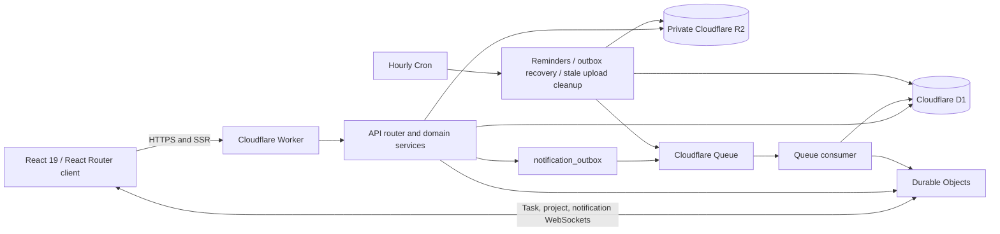

# Enke Project Hub — Complete Product and Engineering Handoff

> Source of truth for product behavior, routes, permissions, Cloudflare architecture, data design, API contracts, testing, deployment, recovery, and the current production state.

## Document status

| Item | Value |
|---|---|
| Product | Enke Project Hub / Enke Project Tracker |
| Application source | `project-tracker/` |
| Production URL | <https://project-tracker.enkedevelopment-427.workers.dev> |
| Last reconciled | 2026-08-20, Asia/Calcutta |
| Verified Worker version | `94a9689e-0b97-4d04-a1bb-86cc4bbe18e1` — version 16, 100% traffic |
| D1 migration baseline | `0001` through `0006` applied |
| Primary audience | Product owner, coding agents, developers, QA, and operators |
| Secrets | Deliberately omitted; this file must never contain passwords, session tokens, API keys, or private recovery material |

This document describes the current implementation, not only the original idea. It supersedes the older counts and version references in `project-tracker/BROWSER_ACCEPTANCE_48.md`, which is retained as historical evidence from an earlier release.

## Instructions for the next coding agent

1. Work inside `project-tracker/` and preserve unrelated files in the outer Flutter repository.
2. Read this file, `project-tracker/README.md`, and `project-tracker/OPERATIONS.md` before changing behavior.
3. Treat server-side authorization, tenant scoping, optimistic concurrency, the notification outbox, private R2 access, and realtime revocation as non-negotiable invariants.
4. Add a D1 migration for every persistent schema change; never edit an already-applied migration.
5. Run `npm run check`, `npm run test:e2e`, `npm run test:e2e:reset`, and `npm audit --omit=dev` before a release.
6. Apply remote migrations before deploying Worker code that depends on them.
7. Capture a D1 Time Travel bookmark before a material production migration or an intentional workspace reset.
8. Never execute a successful production reset merely to test the reset feature. Use the isolated reset suite.
9. Never expose R2 publicly or authorize a file from an object key alone; D1 remains the authorization source.
10. Record the deployed Worker version, migration result, health result, and smoke-test evidence in the release log.

## Executive summary

Enke Project Hub is a private, company-scoped project-management application. Company administrators create members and projects, assign project members, create multi-assignee tasks, manage Kanban execution, and maintain project documents. Ordinary members sign in to their own accounts and see only projects they belong to and tasks assigned to them.

Every task is a collaboration workspace with details, checklist, shared notes and immutable note revisions, private R2 attachments, realtime chat, mentions, replies, reactions, presence, read state, and an audit timeline. Notifications are delivered through a D1-backed durable outbox, Cloudflare Queues, and user-scoped Durable Objects. The application is rendered by React Router from a Cloudflare Worker and uses D1, R2, Queues, Cron Triggers, and three Durable Object classes.

The UI is a minimalist black, white, and neutral shadcn/Radix system. It has a compact collapsible desktop sidebar, an off-canvas tablet/mobile sidebar, custom dialogs instead of browser alerts, Sonner feedback, keyboard-accessible controls, route-backed task tabs, canonical share links, and refresh-safe deep links.

## Product goals

- Give administrators one place to manage company members, projects, tasks, documents, and workspace operations.
- Give members a focused personal workload containing only their assigned work.
- Make priority and deadline ordering authoritative and predictable.
- Make task status changes feel immediate while retaining server authority and rollback safety.
- Keep collaboration inside the task so notes, files, chat, mentions, and history remain attached to the work.
- Keep documents private and versioned without publishing an R2 bucket.
- Make project, task, document, and folder links safe to copy, refresh, and share.
- Preserve actor attribution, auditability, idempotency, and optimistic concurrency for future API or MCP clients.
- Remain Cloudflare-native and operationally simple.

## Roles and permission model

### Roles

- **Super Admin (`super_admin`)** — complete company administration plus protected workspace settings and database reset.
- **Company Admin (`admin`)** — company-wide member, project, task, Kanban, collaboration, and document administration without destructive workspace reset.
- **Member (`member`)** — project access requires active project membership; task access additionally requires an active assignment to that task.

### Permission matrix

| Capability | Super Admin | Company Admin | Member |
|---|---:|---:|---:|
| View all company projects and tasks | Yes | Yes | No |
| View actively assigned projects | Yes | Yes | Yes |
| View tasks | All | All | Assigned only |
| Create and edit projects | Yes | Yes | No |
| Change project lifecycle | Yes | Yes | No |
| Manage project membership | Yes | Yes | No |
| Create tasks and choose assignees | Yes | Yes | No |
| Edit task metadata and assignees | Yes | Yes | No |
| Change task status | Yes | Yes | Assigned tasks only |
| Use checklist, note, chat, and attachments | Yes | Yes | Assigned tasks only |
| Use project document library | Yes | Yes | Assigned projects only |
| Create, edit, suspend, or deactivate members | Yes | Yes | No |
| Reset an ordinary member password | Yes | Yes | No |
| Modify the protected Super Admin through member controls | No | No | No |
| Open workspace Settings | Yes | No | No |
| Reset the workspace database | Yes, with password and phrase | No | No |

### Enforcement rules

- The UI hides unavailable controls, but the API independently rechecks every protected operation.
- Every tenant-owned query binds the authenticated `company_id`; the client does not choose a tenant.
- Ordinary project access requires an active row in `project_members`.
- Ordinary task access requires both active project membership and a row in `task_assignees`.
- Inaccessible project and task lookups normally return `404`, reducing resource enumeration.
- Member bootstrap data contains only relevant task peers, not the complete company directory.
- Suspending, deactivating, demoting, resetting a password, logging out, removing a project member, or removing a task assignee revokes affected realtime connections.
- The protected Super Admin cannot be edited, demoted, suspended, deactivated, or password-reset through ordinary member-management endpoints.

## Domain vocabulary and invariants

### Member states

- `pending` — invited/provisioned but not activated.
- `active` — allowed to authenticate and use authorized resources.
- `suspended` — temporarily blocked; sessions and realtime access are revoked.
- `deactivated` — disabled; historical attribution remains intact.

### Project states

- `draft`
- `active`
- `on_hold`
- `completed`
- `archived`

### Task states

- `todo`
- `in_progress`
- `blocked`
- `review`
- `done`

The UI labels these as To Do, In Progress, Blocked, Review, and Done.

### Priorities

| Priority | Stored rank |
|---|---:|
| Urgent | 4 |
| High | 3 |
| Medium | 2 |
| Low | 1 |

### Authoritative task ordering

Tasks are ordered by:

1. Priority rank descending.
2. Dated tasks before undated tasks.
3. Earliest due date first.
4. Manual order only when status, priority, and due date are equal.
5. Creation time and stable ID as final tie-breakers.

This means an urgent task always appears before a high-priority task. Within the same priority, the nearest due date appears first. A manual drag cannot move a lower-priority or later-due task ahead of a more important task.

## Module 1 — Authentication and account security

### User experience

- Email-and-password sign-in.
- Optional Cloudflare Access identity assertion when Access is configured.
- One-time temporary passwords for new or recovered member accounts.
- Mandatory private-password replacement before workspace data is available.
- Secure sign-out.
- Current-password verification for password changes.
- Member password reset generates a new one-time credential and revokes existing sessions.

### Password and session rules

- Login password input: 10–256 characters.
- New private password: 12–256 characters with uppercase, lowercase, and numeric characters.
- Passwords use PBKDF2-SHA256 and are never stored in plaintext.
- Session tokens are opaque random values; only SHA-256 token hashes are stored in D1.
- Session cookie: `HttpOnly`, `Secure`, `SameSite=Lax`, path `/`, 14-day maximum age.
- Failed login limit: five attempts per email or 30 attempts per IP in a 15-minute window.
- Forced-password-change accounts may call only password-change and logout endpoints.

### Acceptance criteria

- A valid active account can sign in and receives the correct role-scoped workspace.
- A temporary password always opens the private-password gate first.
- Suspended or deactivated accounts are rejected.
- Logout and password change close existing realtime connections covered by that session/user.
- No API response or log contains a plaintext password or session token.

## Module 2 — Workspace Overview

The Overview route presents role-aware metrics and a priority board.

- Administrators see company-wide active workload.
- Members see assigned workload only.
- Metrics include active/assigned tasks, active projects, overdue tasks, and unread updates.
- The five-column board opens the task drawer from a card.
- Project Durable Object events refresh visible task state for connected users.
- Priority and deadline rules remain authoritative on this condensed board.

## Module 3 — Member administration

Administrators can:

- Create a member with email, display name, and Member or Company Admin role.
- Edit display name, normalized email, and role.
- Search, filter, and sort the member list.
- Review project and open-task impact.
- Activate, suspend, or deactivate an account through custom confirmation dialogs.
- Generate a one-time temporary password through a custom reset dialog.
- Copy the temporary password once, then close the credential dialog.

Important rules:

- Emails are normalized to lowercase and unique.
- A role change closes task, project, and notification sockets that the former role authorized.
- Impact preview is shown before suspension/deactivation.
- Historical messages, task updates, documents, and audit attribution remain attached to the original actor.
- A member removed from a project must not retain access through an old task assignment.

## Module 4 — Project management

Administrators can:

- Create a project with a 2–12 character alphanumeric key, name, description, optional target date, and initial members.
- Edit the name, description, target date, and lifecycle state.
- Add or remove active company members.
- Favorite or unfavorite a project.
- Search by key, name, or description.
- Filter by lifecycle state.
- Sort by recent activity, name, or open-task count.
- Copy or share a canonical project link.

Rules:

- Project keys are uppercased and unique within the company.
- Task assignees must be active members of the task’s project.
- Removing a project member is rejected when unresolved task assignments would violate access invariants.
- Project mutations use `expectedVersion` optimistic concurrency.
- Project lifecycle changes create audit and domain events.

## Module 5 — Tasks and My Tasks

### Task creation

Administrators provide:

- Project.
- Title, up to 240 characters.
- Description, up to 20,000 characters.
- Priority.
- Optional UTC due date/time.
- At least one and at most 50 assignees.
- Initial status, normally To Do.

The server allocates a project-local task number and exposes the human-readable key `<PROJECT-KEY>-<NUMBER>`.

### Task list

- Administrators see **Tasks** and all company tasks.
- Members see **My Tasks** and only assigned tasks.
- Search matches task title or task key.
- Filters support priority and status.
- Grouping supports project or status.
- Task filters `q`, `priority`, and `status` are stored in the URL.
- The UI incrementally reveals larger client result sets.
- Administrators can archive and restore tasks without deleting collaboration history.

### Task update rules

- Administrators can edit title, description, priority, due date, assignees, blocked reason, start date, reminder date, and effort points.
- Assigned members may update only task status through the task update API.
- Checklist, note, chat, and attachment permissions are handled by their task-scoped endpoints.
- Every mutation supplies `expectedVersion`; stale writes return `409`.
- A newly added assignee receives assignment semantics, not a duplicate generic update notification.

## Module 6 — Kanban execution

### Columns

- To Do
- In Progress
- Blocked
- Review
- Done

### Interaction modes

- Native desktop drag and drop.
- Touch and pen pointer drag.
- Horizontal edge scrolling during coarse-pointer drag.
- Keyboard movement with `Alt + Left Arrow` and `Alt + Right Arrow`.
- Status dropdown inside the task drawer.

### Optimistic behavior

1. The client moves the card immediately.
2. The API persists the status/order with the current version.
3. ProjectRoom publishes the new task version/order.
4. Other clients refresh.
5. On failure or conflict, the originating client restores the previous state and Sonner explains the rollback.

Manual same-column reordering is accepted only inside the same priority and exact due-date bucket. The server enforces the same guard as the UI.

## Module 7 — Task detail workspace

Each task opens in a route-backed drawer with these tabs:

1. **Details**
2. **Notes**
3. **Attachments**
4. **Chat**
5. **Activity**

The Details tab contains:

- Task status.
- Priority and due state.
- Description.
- Assignees.
- Start date/time.
- Due date/time.
- Reminder date/time.
- Effort points from 1–100.
- Blocked reason.
- Shared checklist and completion progress.

Checklist items support creation, title edits, completion toggles, deletion, stable ordering, actor attribution, and version conflicts.

## Module 8 — Shared task notes

Every task has one shared note that assigned members may update.

- Maximum content length: 100,000 characters.
- Dirty-state indicator while typing.
- Autosave after approximately 1.2 seconds of inactivity.
- Manual Save action.
- Save-in-flight protection so a late response cannot erase newer keystrokes.
- Preview mode.
- Immutable revision history with author and timestamp.
- Restore a historical revision as a new current revision.
- `expectedVersion` conflict protection.
- Professional close dialog offering stay, discard, or save-and-close.
- Audit events for updates and restores.

## Module 9 — Realtime task chat

Task chat is restricted to current task assignees and includes:

- Task-specific WebSocket room.
- Persist-before-broadcast messaging.
- Client idempotency keys.
- Optimistic sending state.
- Reconnect and missed-message catch-up.
- Paginated older history.
- Presence and typing indicators.
- Delivered/read state.
- Replies with quoted context.
- `@mention` suggestions limited to visible task peers.
- Mention and reply notifications.
- Author-only edit and soft delete.
- Message version conflicts.
- Reactions for 👍, ✅, and 🎉.
- Immediate socket revocation after loss of access.
- Normal client disconnects reconnect and catch up; authorization close code `1008` is terminal, cancels pending reconnects, and cannot race an intentional sign-out.

Message body limit is 4,000 characters. Deterministic outbox IDs allow an idempotent resend to repair a missed notification publication without duplicating the message.

## Module 10 — Task attachments

Assigned task members can upload task-scoped files to private R2.

- Multiple-file selection and drag/drop.
- File paste from the task chat surface.
- Per-file progress and cancellation.
- Maximum 50 MiB per file.
- Inline image preview.
- Inline video and audio playback with HTTP byte-range support.
- Generic download for other safe file types.
- Protected authenticated view/share link.
- Failed/cancelled/stale object cleanup.
- Task/project consistency validation before metadata or bytes are accepted.

Task attachments inherit task assignment authorization, not only project membership.

## Module 11 — Project documents

Each accessible project has a private document library with:

- Nested folders and breadcrumbs.
- Project switching.
- Name, description, and type search.
- Active and archived views.
- File uploads.
- Uploading a new immutable version to an existing document.
- Version history.
- Restoring a previous version as a new immutable current version.
- Editable display name and description.
- Archive reason, archive, and restore workflows.
- Protected download and safe inline preview.
- Canonical document and folder links.
- Refresh-time reconstruction of the owning project and complete folder trail.

Rules:

- Folder depth is validated and cycles/invalid ancestry are rejected.
- A non-empty folder cannot be archived until its active children are handled.
- A document cannot be restored into an archived/missing parent folder.
- Project documents require project access; task-scoped documents require task access.
- HTML, XHTML, SVG, XML, and equivalent active-content uploads are blocked by filename and MIME type.
- D1 stores authorization and version metadata; R2 stores bytes under generated keys.

## Module 12 — Notifications

The notification center supports:

- Realtime user-scoped delivery.
- Sidebar and top-bar unread badges.
- All/unread filtering.
- Mark one or all notifications read.
- Direct navigation to the correct project, task tab, document, or folder.
- Preferences for assignments, status/task changes, mentions, replies, due reminders, and document updates.
- User mute state in the data model.
- Hourly due/reminder generation.
- D1 outbox recovery, Queue retry, current-access revalidation, and deduplication.

Supported event semantics:

- `task.assigned`
- `task.updated`
- `task.message`
- `task.mentioned`
- `task.replied`
- `document.ready`
- `due.reminder`

## Module 13 — Activity and audit history

The task Activity tab shows event, actor/system identity, and time. D1 audit records cover member, project, task, checklist, note, chat, document, upload, and destructive workspace actions.

Actor metadata is compatible with `user`, `mcp`, or `system`. Stable IDs, request IDs, aggregate versions, domain events, audit events, and idempotency keys let a future authenticated MCP adapter call the same domain services without bypassing policy.

## Module 14 — Super Admin Settings and database reset

Settings are visible only to the Super Admin and show workspace identity, slug, timezone, primary administrator, and operational counts.

Reset requires both:

1. The current Super Admin password.
2. The exact phrase `RESET <workspace-slug>`.

A successful reset:

- Revokes task, project, and notification sockets.
- Deletes company projects, tasks, notes, checklists, messages, documents, notifications, preferences, outbox rows, audit/domain events, non-Super-Admin accounts, and their sessions.
- Deletes all company-prefixed R2 objects.
- Preserves the company record.
- Preserves the initiating Super Admin account and initiating session.
- Creates a fresh `company.database_reset` audit event.
- Returns `storageCleanupComplete`; the UI shows a persistent warning if R2 cleanup is incomplete.

No browser-native `alert()` or `confirm()` is used. The entire flow uses shadcn Alert Dialog controls.

## End-to-end workflows

### Company onboarding

1. A Super Admin or Company Admin creates company member accounts.
2. Each new member receives a one-time temporary password.
3. The member signs in and must choose a private password.
4. An administrator creates a project and assigns project members.
5. An administrator creates tasks with one or more assignees.
6. Assigned members see those tasks in Overview and My Tasks.

### Daily task execution

1. A user opens Overview or Tasks.
2. Tasks are presented by priority and nearest deadline.
3. The user moves a task by drag, touch, keyboard, or status selector.
4. The UI changes immediately while the server persists the mutation.
5. Other connected project users receive a realtime invalidation.
6. A failed write restores the previous state and reports the error.

### Task collaboration

1. An assigned member opens a task deep link.
2. The member updates status or checklist progress.
3. The member edits the shared note, adds attachments, or sends chat messages.
4. Mentions and replies create recipient notifications when preferences allow them.
5. Notes, revisions, chat history, files, versions, and activity survive refresh.
6. Removing the assignment immediately removes task access and closes realtime connections.

### Document lifecycle

1. A project member opens the project document root.
2. They create folders or follow a shared folder link.
3. They upload a file into the current folder.
4. A later upload creates an immutable new version for that document.
5. Restoring an earlier version creates another immutable version and promotes it.
6. File, document, and folder links require authentication and current authorization.

## Canonical application routes

| Route | Purpose and persisted state |
|---|---|
| `/` | Accepted entry alias; renders the workspace/login flow. |
| `/overview` | Canonical overview and priority board. |
| `/tasks` | Tasks/My Tasks. Supports URL-backed `q`, `priority`, and `status`. |
| `/tasks/:taskRef` | Opens a task drawer; ID or readable task key is accepted, shared links use the task key. |
| `/tasks/:taskRef?tab=notes` | Opens Notes and survives refresh. |
| `/tasks/:taskRef?tab=attachments` | Opens Attachments and survives refresh. |
| `/tasks/:taskRef?tab=chat` | Opens Chat and survives refresh. |
| `/tasks/:taskRef?tab=activity` | Opens Activity and survives refresh. |
| `/projects` | Project portfolio. |
| `/projects/:projectRef` | Selects a project; ID or case-insensitive key is accepted, shared links use the key. |
| `/documents` | Project-library entry point. |
| `/projects/:projectRef/documents` | Canonical project document root. |
| `/projects/:projectRef/documents/:documentId` | Canonical file or folder route; project and breadcrumb are reconstructed after refresh. |
| `/members` | Admin-only member administration. |
| `/notifications` | Current user’s notification inbox and preferences. |
| `/settings` | Super-Admin-only settings and Danger Zone. |

### Route behavior

- React Router serves a wildcard application route so valid deep links load directly.
- Malformed percent-encoded paths are redirected safely to `/overview` instead of returning a Worker error.
- Unknown or extra-segment paths canonicalize to `/overview` with user feedback.
- An unavailable task returns to `/tasks`.
- An unavailable project returns to `/projects` or `/documents` as appropriate.
- Members attempting `/members` or `/settings` return to `/overview`.
- A document notification resolves the document’s actual owning project before navigation.
- Opening a task from a filtered Tasks list stores a safe return path; closing restores the list query during that navigation session.

### Ephemeral UI state

Task filters and task tabs are URL-backed. Project/member/document search and sort controls, modal state, chat drafts, upload progress, and sidebar open/collapsed state are UI-local and may reset on reload. Promote any of these to query parameters only when a product requirement calls for shareable state.

## Copy and share behavior

- Project link: `/projects/:projectKey`
- Task link: `/tasks/:taskKey`, including the non-Details tab when selected.
- Document/folder link: `/projects/:projectKey/documents/:documentId`
- Task attachment view: protected `/api/v1/document-versions/:versionId/view`

The reusable Share control:

- Creates a same-origin absolute URL.
- Uses Web Share when available.
- Falls back to Copy Link when Web Share is unavailable.
- Uses Clipboard API first and a temporary selection fallback if clipboard access is rejected.
- Treats native share cancellation as a normal cancellation.
- Reports success/error through Sonner.

Sharing never grants access. The recipient must authenticate and pass the project/task/document policy again.

## UI design system

### Component policy

Use shadcn/Radix primitives for interactive controls:

- Button
- Input
- Textarea
- Select
- Dropdown Menu
- Dialog
- Alert Dialog
- Checkbox
- Radio Group
- Card

Hidden native file inputs remain appropriate behind styled upload controls. Semantic download links, media elements, and progress elements remain native where the browser provides the correct behavior.

### Visual language

- Black, white, and zinc/neutral palette only.
- Minimal card borders and subtle neutral shadows.
- Black primary/destructive actions with white text.
- Lucide icons.
- Consistent spacing, visible focus rings, labelled controls, dialog descriptions, and live regions.
- No native browser alert, prompt, or confirm UI.

### Sidebar and responsiveness

- Expanded desktop sidebar: approximately 232 px.
- Collapsed icon rail: approximately 72 px.
- Expand/collapse control remains inside the application top bar.
- Collapsed icons retain accessible names and hover titles.
- At 900 px and below, navigation becomes an off-canvas drawer with scrim and Close action.
- At 780 px and below, grids stack where appropriate.
- Kanban becomes horizontally scrollable with snap-aligned columns.
- Long titles, footer metadata, breadcrumbs, and task controls wrap or truncate without page-level horizontal overflow.

### Sonner standard

Use one top-right light-theme Sonner toaster for project, task, member, checklist, note, chat, upload, document, link, notification, and reset outcomes. Keep inline field/form errors when correction needs local context. Update a loading toast in place rather than creating duplicate success/error toasts.

## Cloudflare architecture



### Worker handlers

`project-tracker/workers/app.ts` exposes:

- `fetch` — React Router SSR, API routes, and WebSocket upgrades.
- `queue` — notification event consumption.
- `scheduled` — due reminders, outbox recovery, and stale-upload cleanup.

### Bindings

| Binding | Cloudflare product | Purpose |
|---|---|---|
| `DB` | D1 | Relational application state, sessions, history, audit, outbox |
| `FILES` | R2 | Private document and attachment bytes |
| `EVENTS` | Queues | Asynchronous notification publication/consumption |
| `TASK_ROOMS` | Durable Objects | Task chat, presence, typing, reads, revocation |
| `PROJECT_ROOMS` | Durable Objects | Project task-version/reorder invalidation |
| `NOTIFICATION_ROOMS` | Durable Objects | User-scoped realtime notification delivery |

The Cron expression is `0 * * * *` and observability/source-map upload are enabled in `project-tracker/wrangler.jsonc`.

## D1 data model

| Domain | Tables |
|---|---|
| Company and identity | `companies`, `users`, `company_members`, `user_sessions`, `login_attempts` |
| Projects | `projects`, `project_members`, `project_counters`, `project_favorites` |
| Tasks and Kanban | `tasks`, `task_assignees`, `task_watchers`, `task_checklist_items` |
| Notes | `task_notes`, `task_note_revisions` |
| Chat | `task_messages`, `task_message_mentions`, `task_message_reactions`, `task_read_states` |
| Documents | `documents`, `document_versions`, `document_tags` |
| Notifications | `notifications`, `notification_preferences`, `notification_outbox` |
| Traceability | `audit_events`, `domain_events`, `idempotency_keys` |

### Data principles

- Tenant-owned rows carry `company_id`.
- IDs are opaque prefixed UUIDs.
- Project task numbering is allocated from `project_counters`.
- Notes and documents retain immutable revision/version history.
- Soft archive/delete preserves historical attribution.
- `expectedVersion` protects projects, tasks, notes, checklists, messages, and documents from silent overwrites.
- Notification deduplication makes repeated Queue delivery safe.

## Durable Objects and realtime rules

### TaskRoom

- One Durable Object name per task ID.
- WebSocket upgrade is authorized by the API before trusted identity headers are forwarded.
- D1 access is revalidated on every inbound chat message.
- Sockets are tagged by user ID for revocation.
- Messages persist before broadcast.
- Presence, typing, read state, reactions, edits, deletes, mentions, and replies remain task-scoped.

### ProjectRoom

- One room per project.
- Publishes task version and reorder invalidations.
- Role/membership changes revoke no-longer-authorized listeners.

### NotificationRoom

- One room per user.
- Publishes notification-created events to refresh the inbox/badge.
- Account/session/role changes revoke affected listeners.

## Notification outbox and Queue flow

1. The domain mutation inserts a `notification_outbox` row before Queue publication.
2. A lease prevents concurrent publishers from claiming the same row.
3. Failed publication records the error and applies bounded exponential retry.
4. The scheduled handler republishes eligible unconsumed rows.
5. The consumer revalidates company membership, project/task/document access, archive state, notification preference, and mute state.
6. `notifications` deduplicates by user and event key.
7. The consumer marks the event consumed.
8. Old consumed outbox records are removed after retention.

This prevents a successful domain write from silently losing its notification when Queue publication is temporarily unavailable.

## Private R2 upload lifecycle

1. Client requests an upload initiation with filename, normalized MIME type, declared size, scope, and optional existing document ID.
2. Server authorizes the owning project/task and validates parent hierarchy.
3. D1 creates a pending document version and generated R2 object key.
4. Client uploads bytes to the authenticated Worker endpoint.
5. An atomic claim prevents double finalization.
6. Server writes R2 bytes, verifies stored size, and promotes the version to ready.
7. A newer completed version cannot be replaced by an older concurrent completion.
8. Failure/cancellation removes pending metadata and R2 bytes where possible.
9. The scheduled cleanup removes incomplete uploads older than two hours.

Inline previews use a MIME allowlist, `nosniff`, and a sandboxed CSP. R2 has no public URL in the application contract.

## Reminder behavior

The hourly scheduled handler creates a reminder when an explicit `reminder_at` has arrived or a due date falls within the next 24 hours. It excludes completed tasks, archived tasks, and archived projects. The consumer again verifies active company membership, project membership, task assignment, preferences, and mute state. Deterministic event IDs and notification deduplication prevent hourly duplicates.

## API conventions

### Envelope

Successful JSON responses:

```json
{
  "data": {},
  "meta": { "requestId": "req_..." }
}
```

Error responses:

```json
{
  "error": {
    "code": "STABLE_MACHINE_CODE",
    "message": "Human-readable explanation",
    "fieldErrors": {},
    "requestId": "req_..."
  }
}
```

JSON responses use `Cache-Control: no-store`. Callers may provide an `x-request-id` no longer than 128 characters; otherwise the Worker generates one.

### Endpoint map

#### System and identity

| Method | Endpoint | Purpose |
|---|---|---|
| GET | `/api/v1/health` | D1-backed health result |
| POST | `/api/v1/auth/login` | Password login and session cookie |
| POST | `/api/v1/auth/logout` | Revoke session and realtime access |
| POST | `/api/v1/auth/password` | Replace current/temporary password |
| GET | `/api/v1/bootstrap` | Role-scoped application bootstrap |
| GET | `/api/v1/meta/mcp` | MCP-readiness manifest |
| POST | `/api/v1/settings/reset-database` | Protected Super Admin reset |

#### Members and projects

| Method | Endpoint | Purpose |
|---|---|---|
| POST | `/api/v1/members` | Create member |
| PATCH | `/api/v1/members/:id` | Edit member |
| GET | `/api/v1/members/:id/impact` | Lifecycle impact preview |
| POST | `/api/v1/members/:id/status` | Activate/suspend/deactivate |
| POST | `/api/v1/members/:id/reset-password` | Generate one-time credential |
| GET/POST | `/api/v1/projects` | List/create projects |
| PATCH | `/api/v1/projects/:id` | Edit/lifecycle project |
| GET/PUT | `/api/v1/projects/:id/members` | Read/replace project membership |
| POST/DELETE | `/api/v1/projects/:id/favorite` | Add/remove current-user favorite |
| GET | `/api/v1/projects/:id/events/socket` | Project realtime WebSocket |

#### Tasks and collaboration

| Method | Endpoint | Purpose |
|---|---|---|
| GET/POST | `/api/v1/tasks` | List/create tasks |
| GET/PATCH | `/api/v1/tasks/:id` | Read/update task |
| POST | `/api/v1/tasks/reorder` | Persist guarded manual order |
| POST | `/api/v1/tasks/:id/archive` | Archive task |
| POST | `/api/v1/tasks/:id/restore` | Restore task |
| GET/PUT | `/api/v1/tasks/:id/note` | Read/save shared note |
| GET | `/api/v1/tasks/:id/note/revisions` | Note history |
| POST | `/api/v1/tasks/:id/note/revisions/:revisionId/restore` | Restore note revision |
| GET/POST | `/api/v1/tasks/:id/checklist` | List/create checklist items |
| PATCH/DELETE | `/api/v1/tasks/:id/checklist/:itemId` | Update/delete checklist item |
| GET | `/api/v1/tasks/:id/messages` | Paginated chat history |
| PATCH/DELETE | `/api/v1/tasks/:id/messages/:messageId` | Edit/soft-delete message |
| POST | `/api/v1/tasks/:id/messages/:messageId/reactions` | Toggle reaction |
| POST | `/api/v1/tasks/:id/read` | Advance task read sequence |
| GET | `/api/v1/tasks/:id/activity` | Task audit timeline |
| GET | `/api/v1/tasks/:id/chat/socket` | Task chat WebSocket |

#### Documents and R2

| Method | Endpoint | Purpose |
|---|---|---|
| GET | `/api/v1/projects/:id/documents` | List project/task documents |
| POST | `/api/v1/projects/:id/folders` | Create folder |
| POST | `/api/v1/projects/:id/uploads/initiate` | Create pending upload/version |
| PUT/DELETE | `/api/v1/uploads/:versionId` | Upload bytes or cancel |
| GET | `/api/v1/documents/:id` | Resolve document and folder trail |
| PATCH | `/api/v1/documents/:id` | Edit metadata |
| POST | `/api/v1/documents/:id/archive` | Archive document/folder |
| POST | `/api/v1/documents/:id/restore` | Restore document/folder |
| GET | `/api/v1/documents/:id/versions` | Version history |
| POST | `/api/v1/documents/:id/versions/:versionId/restore` | Restore as new immutable version |
| GET | `/api/v1/document-versions/:id/download` | Authorized attachment download |
| GET | `/api/v1/document-versions/:id/view` | Authorized safe inline view |

#### Notifications

| Method | Endpoint | Purpose |
|---|---|---|
| GET | `/api/v1/notifications` | List current-user notifications |
| POST | `/api/v1/notifications/:id/read` | Mark one read |
| POST | `/api/v1/notifications/read-all` | Mark all read |
| GET/PUT | `/api/v1/notification-preferences` | Read/save preferences |
| GET | `/api/v1/notifications/socket` | User notification WebSocket |

## Security controls

- Optional Cloudflare Access issuer, audience, signature, expiry, subject, and email validation.
- PBKDF2-SHA256 fallback credentials.
- Hashed opaque session tokens and revocation timestamps.
- Strict active-membership and tenant checks.
- Project and task policy helpers in `server/security/policies.ts`.
- Zod validation at the HTTP trust boundary.
- Prepared/bound D1 statements.
- Optimistic versions for write conflicts.
- Idempotency keys for chat/domain integrations.
- Private R2 and authenticated download/view endpoints.
- Blocked active-content upload types.
- Login rate limiting.
- Socket revalidation and revocation.
- Audit and domain events.
- Security headers: CSP, `X-Content-Type-Options: nosniff`, frame denial, strict referrer policy, and restrictive camera/microphone/geolocation permissions.
- Local demo/session-test authentication switches are hostname-gated and inert on deployed hosts.

## Local development

Prerequisites:

- Node.js 22.
- npm.
- A Cloudflare account and Wrangler login only for remote operations.

```bash
cd project-tracker
npm ci
npm run db:migrate:local
npm run dev
```

Local requests use the seeded demo identity unless the loopback-only real-session test header is explicitly enabled by the test harness.

## First Super Admin bootstrap

Fresh migrations intentionally leave the first Super Admin password unset.

```bash
npm run db:migrate:remote
npm run bootstrap:superadmin -- --remote --email=<super-admin-email>
```

The script:

- Prompts twice without echoing the password.
- Sends only a salted Worker-compatible hash to D1.
- Updates exactly one active Super Admin whose password is still null.
- Sets mandatory password replacement for first login.
- Refuses reuse after the first credential is installed.
- Supports `--password-stdin`; never pass a password as a command argument or store it in an environment file.
- Supports local disposable `--persist-to=<directory>` only with `--local`.

## Testing strategy

### Commands

```bash
npm run typecheck
npm test
npm run build
npm run check
npm run test:e2e
npm run test:e2e:reset
npm run test:all
npm audit --omit=dev
```

### Unit and Worker-runtime tests

- 12 standard validation/auth/hash/invariant tests.
- 2 Cloudflare Worker-runtime outbox tests.
- `npm run check` runs type generation, strict TypeScript, all 14 tests, and client/SSR production builds.

### Default Playwright inventory

The default suite contains 28 Chromium tests covering:

- Multi-assignee task creation.
- Route, query, task-tab, project, folder, and document refresh/share behavior.
- Invalid-route canonicalization and unauthorized API boundaries.
- Collaboration, documents, responsive navigation, and accessibility.
- Custom dialogs and reset guards.
- Account switching and role isolation.
- Optimistic Kanban status movement and persistence.
- Notification preferences.
- Document archive/restore, folder hierarchy, and version behavior.
- Task archive/restore.
- 850 px off-canvas navigation.
- Note save-before-close/autosave.
- Chat reconnect.
- Same-column guarded ordering.
- Reset-storage warning UI.
- Concurrent document upload monotonicity and note conflict handling.
- Logout socket revocation.
- Role-demotion socket revocation.
- Correct assignment notification semantics.
- Assigned-member privacy, R2 collaboration, mentions, receipts, and revocation.
- Touch, keyboard, and desktop Kanban movement.

The separate destructive reset suite contains one isolated test. It creates a fresh OS temporary Wrangler state, generates all passwords at runtime, exercises real cookie sessions, seeds D1 and R2, executes the reset, verifies preserved/revoked sessions and physical R2 deletion, tests invalid password/phrase denial, and removes the temporary state. It never targets production.

### Last verified evidence

- `npm run check`: passed.
- Standard tests: 12/12 passed.
- Worker-runtime outbox tests: 2/2 passed.
- Fresh 2026-08-20 default Playwright run: 28/28 passed in one worker against fresh isolated state.
- Fresh isolated reset Playwright: 1/1 passed.
- Full `npm run test:all`: passed in 354.9 seconds.
- Production dependency audit: 69 production dependencies and zero known vulnerabilities.
- Production D1 foreign-key check: clean.
- Production health: HTTP 200.
- Production D1 outbox: 6 total, 6 consumed, 0 pending, and 0 errors.

## Current production verification state

Verified on 2026-08-20:

- Worker version `94a9689e-0b97-4d04-a1bb-86cc4bbe18e1` was deployed at 100% in deployment `90a6bae7-8eba-4297-b68f-d38c75e4252f`.
- D1 migrations `0001`–`0006` were applied.
- D1 Time Travel bookmark was captured immediately before the final deployment: `00000051-00000000-000050cd-b5d62ec181fa9d0a52c85de4f4b12d84`. It can become stale and must be recaptured immediately before any future migration or restore.
- Worker fetch, queue, and scheduled handlers and all expected bindings were present.
- All 4 deployed Worker modules matched `build/server` byte-for-byte. All 11 client assets returned HTTP 200 and matched `build/client` byte-for-byte. The live dashboard asset was `assets/dashboard-C2OENJcW.js` with SHA-256 `6C015D02A45C32223FF7AE6C23A5061B6072B3BAEA647EBC1FDE2F6E621E1930` locally and remotely.
- Live health returned HTTP 200 with production environment, `no-store`, CSP, `DENY`, `nosniff`, and strict referrer-policy headers.
- D1 `quick_check` returned `ok`; `foreign_key_check` returned zero violations. Every verification query reported no write.
- Queue had one producer and one consumer. R2 contained 5 objects/1.38 kB; D1 contained 5 ready document versions and no missing R2 keys.
- Admin routes, custom dialogs, refresh-safe deep links, and copy/share behavior passed automated and live checks.
- A live ordinary-member session reached `/overview`, showed My Tasks, omitted Members and Settings, exposed only its assigned `CHROMEQA-3` task, and did not expose `CHROMEQA-2`.
- The member project list exposed only `Chrome Full-Cycle QA Project`.
- Lowercase task/project aliases replaced themselves with canonical `/tasks/CHROMEQA-3` and `/projects/CHROMEQA/...` URLs. Invalid task tab/priority/status values were removed.
- `/tasks/CHROMEQA-3?tab=notes`, `?tab=attachments`, and `?tab=activity` survived reload. `/projects/CHROMEQA/documents` and valid task filters also survived reload.
- The live task exposed two private R2 attachments: `release-qa-image.png` and `release-qa-readme.txt`.
- Admin and member chat sessions both showed `2 online`.
- Persisted live QA chat/mention/reply messages were not submitted in the final browser cycle because the user changed the request before approving those exact representational messages. Automated multi-actor chat, mention, receipt, reconnect, and revocation coverage remains green.

### Disposable production QA fixture

- Project: `CHROMEQA` / Chrome Full-Cycle QA Project.
- Task: `CHROMEQA-3` / Release QA collaboration and R2 verification.
- Priority: High.
- Status at final live inspection: In Progress.
- Due: 2026-08-21 17:00 in the displayed workspace timezone.
- Assigned to the Release QA Member and Chrome QA Company Admin.
- Contains two non-sensitive QA attachments.

No password, email credential, temporary credential, or session material is recorded in this document.

## Release procedure

1. `npm ci`
2. `npm run check`
3. `npm run test:e2e`
4. `npm run test:e2e:reset`
5. `npm audit --omit=dev`
6. Capture a D1 Time Travel bookmark.
7. `npm run db:migrate:remote`
8. `npm run deploy`
9. Record the immutable Worker version ID.
10. Verify `/api/v1/health`, login, forced password change, and `/api/v1/bootstrap`.
11. Verify D1, R2, Queue, Durable Object, Cron, observability, and source-map bindings.
12. Run an authenticated admin/member smoke test for routes, one task status change, realtime presence, notifications, and an authorized R2 download.
13. Verify outbox rows are published/consumed and `PRAGMA foreign_key_check` is clean.

## Recovery and rollback

### D1

Before a material migration:

```bash
npx wrangler d1 time-travel info enke-project-tracker
```

If recovery is required, stop writes, validate the exact bookmark, and run the restore command Wrangler provides. After restore, check critical table counts, document metadata versus R2 keys, authenticated smoke behavior, and foreign keys before reopening writes.

### Worker

```bash
npx wrangler versions list
npx wrangler deployments list --name project-tracker
```

Select and inspect the last known-good immutable version before deploying it. Re-run health, authentication, WebSocket, notification, and R2 smoke checks after rollback.

### R2 consistency

- Treat D1 document-version rows as the expected-object inventory.
- Compare expected keys with bucket inventory; do not delete unmatched objects during incident investigation.
- Verify samples only through authorized application endpoints.
- Restore metadata and objects as one consistency set.

## Observability and incident response

- Worker requests log method, path, status, duration, and request ID as structured JSON.
- Observability is enabled with source maps.
- API errors expose stable codes and request IDs while hiding unexpected internals.
- Audit by company, actor, action, project, task, document, and time.
- For compromised accounts, revoke sessions, change/reset credentials, and rotate any relevant Worker secret.
- Inspect `notification_outbox` for unconsumed rows, leases, attempt counts, and last error.
- Inspect Queue consumer failures and Durable Object disconnect patterns.
- Compare D1 document metadata with R2 keys when uploads/downloads are affected.

## Repository and CI integration gap

This is not a production-runtime failure, but it is a release-engineering blocker that the next agent must fix before claiming repository-based CI:

- The outer repository currently ignores `/project-tracker` in `.gitignore`.
- `git ls-files project-tracker` currently returns zero files.
- The quality workflow is located at `project-tracker/.github/workflows/quality.yml`; GitHub discovers workflows only from the repository-root `.github/workflows/` directory.
- The nested workflow also omits the isolated `npm run test:e2e:reset` gate.

Required correction:

1. Remove the intentional `/project-tracker` ignore rule when the product is ready to be versioned.
2. Add the application source, migrations, tests, lockfile, docs, and configuration to the repository.
3. Move the Project Tracker workflow to the outer `.github/workflows/` directory.
4. Retain `working-directory: project-tracker` and `cache-dependency-path: project-tracker/package-lock.json`.
5. Add `npm run test:e2e:reset` to the workflow.
6. Confirm a real push/PR triggers the workflow and all gates pass.

Until then, the successful quality evidence is local and production smoke evidence, not a discoverable GitHub Actions run.

## Known constraints and next improvements

These are improvements to current modules, not requirements for new top-level modules:

- Add a first-class staging environment in `wrangler.jsonc` with separate D1, R2, Queue, and Durable Object resources.
- Complete the repository/CI integration described above.
- Move project, member, and document search/sort/filter state into URL query parameters if those filtered views must be shareable.
- Add server-side pagination for very large task, member, document, notification, and audit datasets; current incremental task display is primarily client-side.
- Configure Cloudflare Access domain/audience if company SSO is desired; the current production fallback is password/session authentication.
- Add automated production-safe smoke checks that send uniquely prefixed QA chat messages only when the operator explicitly authorizes the representational action.
- Add alerting for old unconsumed outbox rows, repeated Queue failures, stale pending uploads, and D1/R2 inventory drift.
- Consider malware scanning as a separate upload hardening layer; the current state machine and active-content blocking do not claim antivirus scanning.
- Keep `project-tracker/BROWSER_ACCEPTANCE_48.md` clearly marked historical or regenerate it from the current 28+1 E2E inventory.

## Recommended implementation order for a clean rebuild

If another coding agent must rebuild the application rather than extend it, use this order:

1. **Repository foundation** — React Router Worker, strict TypeScript, Wrangler bindings, migrations, local harness, CI.
2. **Identity** — users, company membership, password/session security, first-login gate, Access adapter.
3. **Policy layer** — tenant, role, project membership, task assignment, Super Admin protections.
4. **Projects and members** — CRUD/lifecycle, project membership, counters, audit.
5. **Tasks** — multi-assignee creation, human keys, filters, status/priority/deadline rules, optimistic versions.
6. **Kanban** — deterministic ordering, optimistic movement, drag/touch/keyboard, ProjectRoom invalidation.
7. **Task collaboration** — checklist, note revisions, activity.
8. **Chat** — TaskRoom, idempotent persistence, presence, reads, mentions, replies, reactions, revocation.
9. **R2 documents** — folders, upload state machine, task attachments, immutable versions, authorized view/download.
10. **Notifications** — preferences, D1 outbox, Queue, NotificationRoom, reminders, recovery.
11. **Routes and sharing** — canonical keys, refresh reconstruction, invalid-route canonicalization, access-safe redirects.
12. **shadcn polish** — monochrome design, sidebar, responsive overflow, dialogs, Sonner, accessibility.
13. **Danger Zone** — password/phrase reset, R2 cleanup reporting, isolated destructive tests.
14. **Operations** — bootstrap, time-travel bookmark, deploy, rollback, monitoring, production smoke.

## Definition of done for any future change

- Product behavior and role permissions are explicit.
- UI and API enforce the same rule.
- Tenant, project, and task scope are server-verified.
- Input validation and stable error codes exist.
- Persistent changes have a forward-only migration.
- Concurrent mutations use a version/idempotency strategy.
- Realtime access is revoked when authorization changes.
- Notification publication is durable or explicitly recoverable.
- R2 bytes cannot be accessed without D1 authorization.
- Route and query behavior survives refresh when intended.
- Share links reopen the exact resource and never grant access.
- Optimistic UI has rollback behavior.
- Custom shadcn dialogs replace browser-native prompts.
- Sonner reports success, failure, and rollback without duplicate noise.
- Desktop, 850 px tablet, and mobile overflow are tested.
- Keyboard and accessible-name behavior are tested.
- Unit/runtime tests, Playwright, reset suite, build, and production dependency audit pass.
- Release notes record migration, Worker version, bookmark, health, bindings, smoke results, and any intentionally deferred live action.

## Authoritative source map

| Concern | Primary file(s) |
|---|---|
| Full application UI and route state | `project-tracker/app/components/dashboard.tsx` |
| shadcn primitives | `project-tracker/app/components/ui/` |
| Monochrome/responsive styles | `project-tracker/app/shadcn.css` |
| React Router configuration | `project-tracker/app/routes.ts`, `project-tracker/react-router.config.ts` |
| Worker entry and security headers | `project-tracker/workers/app.ts` |
| API routing | `project-tracker/server/api/router.ts` |
| Domain rules | `project-tracker/server/domain/service.ts` |
| Validation | `project-tracker/server/domain/validation.ts` |
| Authentication/session/password | `project-tracker/server/auth/` |
| Authorization policies | `project-tracker/server/security/policies.ts` |
| D1 schema model | `project-tracker/server/db/schema.ts` |
| D1 migrations | `project-tracker/migrations/` |
| Task/project/notification realtime | `project-tracker/workers/durable-objects/` |
| Queue, reminders, outbox recovery, cleanup | `project-tracker/workers/events.ts` |
| Cloudflare bindings | `project-tracker/wrangler.jsonc` |
| Unit/runtime tests | `project-tracker/test/` |
| Browser tests | `project-tracker/e2e/` |
| First Super Admin bootstrap | `project-tracker/scripts/bootstrap-superadmin.mjs` |
| Operator runbook | `project-tracker/OPERATIONS.md` |
