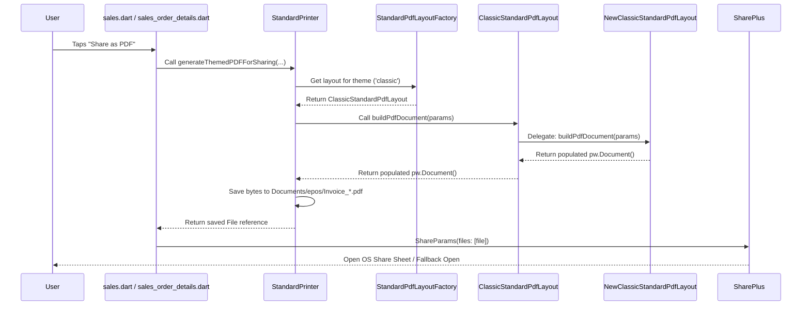

# Classic PDF Layout - Corrupted PDF Fix

- **Date:** 2026-07-17
- **Branch:** mubashir-dev

---

## 1. Problem Summary

### User-Facing Impact
When users selected the "Share as PDF" option from the Sales Orders List (or details screen) while the active layout was set to the **Classic** theme, the generated PDF file was corrupted. While the file was successfully created at the correct path in the local file system (e.g., `Documents/epos/Invoice_*.pdf`), attempting to open it in any external PDF viewer resulted in a blank screen or a "corrupted file/invalid format" error message.

---

## 2. Root Cause

The standard layout framework delegates standalone PDF building (which is required for sharing/attachment flows) to individual theme classes implementing the `StandardPdfLayout` interface.

Inside `ClassicStandardPdfLayout`, the `buildPdfDocument()` method was left unimplemented as a placeholder:
```dart
  @override
  Future<pw.Document> buildPdfDocument(ReceiptLayoutParams params) async {
    debugPrint(
        '[ClassicStandardPdfLayout] buildPdfDocument - delegating to StandardPrinter');
    // For now, return an empty document.
    // The full PDF building logic lives in StandardPrinter.generateAndPrintPDF
    // which handles both building AND saving/opening. When we need standalone
    // PDF building (e.g. for sharing), this can be migrated.
    return pw.Document();
  }
```

Because it returned a fresh, empty `pw.Document()` containing zero pages, the final binary file saved to disk (`pdf.save()`) did not contain valid PDF page markers, rendering it unreadable to PDF viewers.

---

## 3. File Changed

* **[classic_standard_pdf_layout.dart](file:///c:/Users/Mubashir/eposmob/lib/screens/print/standard_layouts/classic_standard_pdf_layout.dart)**

---

## 4. What Changed and Why

We fixed this by importing and delegating `buildPdfDocument()` to **`NewClassicStandardPdfLayout`**, which contains the full, functional, and bilingual A4/A5 PDF generation code that matches the classic layout visual style.

### Code Diff
```diff
diff --git a/lib/screens/print/standard_layouts/classic_standard_pdf_layout.dart b/lib/screens/print/standard_layouts/classic_standard_pdf_layout.dart
index a3521b4..3129def 100644
--- a/lib/screens/print/standard_layouts/classic_standard_pdf_layout.dart
+++ b/lib/screens/print/standard_layouts/classic_standard_pdf_layout.dart
@@ -4,6 +4,7 @@ import 'package:pos_machine/screens/print/layouts/receipt_layout_params.dart';
 import 'package:pos_machine/screens/print/print_standard.dart';
 import 'standard_pdf_layout.dart';
+import 'new_classic_standad_pdf_layout.dart';
 
 /// Classic standard PDF layout - the default A4/A5 PDF design.
 ///
@@ -65,10 +66,7 @@ class ClassicStandardPdfLayout implements StandardPdfLayout {
   @override
   Future<pw.Document> buildPdfDocument(ReceiptLayoutParams params) async {
     debugPrint(
-        '[ClassicStandardPdfLayout] buildPdfDocument - delegating to StandardPrinter');
-    // For now, return an empty document.
-    // The full PDF building logic lives in StandardPrinter.generateAndPrintPDF
-    // which handles both building AND saving/opening. When we need standalone
-    // PDF building (e.g. for sharing), this can be migrated.
-    return pw.Document();
+        '[ClassicStandardPdfLayout] buildPdfDocument - delegating to NewClassicStandardPdfLayout');
+    final newClassic = NewClassicStandardPdfLayout();
+    return newClassic.buildPdfDocument(params);
   }
 }
```

### Why This Fix Works
* **Zero Visual Regressions:** The `NewClassicStandardPdfLayout` was designed to be the modern drop-in equivalent of the legacy classic print template, ensuring a populated document layout.
* **Separation of Concerns:** Keep the printer wrapper (`StandardPrinter`) clean from direct sharing side-effects, relying on the unified standard layout factory.

---

## 5. How the Share PDF Flow Works



1. **User Action:** The user clicks the share button on the Sales Orders List or Detail screen.
2. **Printer Delegation:** The controller instantiates `StandardPrinter` and triggers `generateThemedPDFForSharing()`.
3. **Layout Resolution:** The layout factory resolves the layout class based on settings (resolving `'classic'` to `ClassicStandardPdfLayout`).
4. **PDF Construction:** The classic layout instantiates `NewClassicStandardPdfLayout` to build a populated `pw.Document` containing store info, billing info, item tables, and tax summaries.
5. **Disk Write:** The generated document is saved to the local tenant directory (`Documents/epos/`).
6. **Native Sharing:** The file path is handed to `SharePlus` to display the native sharing tray.

---

## 6. Verification

1. **Static Analysis:**
   Ensure there are no compilation issues by running:
   ```bash
   flutter analyze
   ```
2. **Functional Test:**
   * Open the app and navigate to **Sales Orders**.
   * Pick any Sales Order and tap the share icon/button.
   * Verify that the PDF generation loader completes, the share screen/viewer opens, and the file renders the complete document layout (logo, particulars table, taxes, totals, QR) rather than displaying a blank or corrupted document warning.
