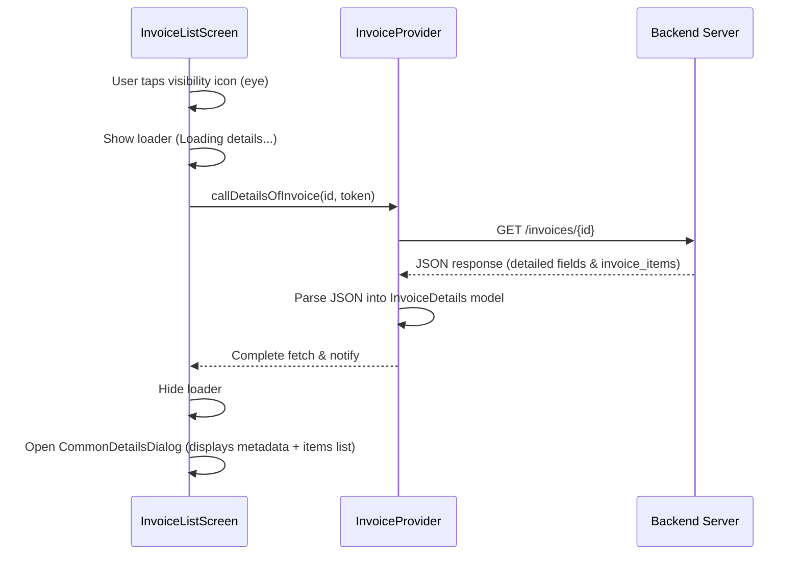

# Invoice Details API Integration Documentation

This document explains how the Invoice Details view retrieves its detailed records (including line items/products) from the backend database server and lists them inside the user interface.

---

## 1. Overview & Data Flow
The primary Invoice list endpoint (`/invoices`) returns a lightweight summary list of transactions (e.g. invoice numbers, dates, statuses, and total amounts) to optimize performance.

To view the specific products/items associated with a particular invoice, a secondary detailed query is made when the user requests a view.



---

## 2. API Endpoint Specification

* **Endpoint Constant:** `APPUrl.detailsOfInvoice`
* **URL Structure:** `GET {BASE_URL}/invoices/{id}`
* **Query Parameters:**
  * `store_id` (optional): Active shop/store ID value.
* **Headers:**
  * `Authorization`: `Bearer <access_token>`
  * `X-Tenant`: API tenant key loaded from device preferences.

---

## 3. Data Model Structure
The JSON response payload is mapped using the `InvoiceDetails` class inside [invoice_details.dart](file:///c:/Users/Mubashir/eposmob/lib/models/invoice_details.dart).

```dart
class InvoiceDetails {
  final String invoiceNumber;
  final String amount;
  final Customer customer;
  final List<InvoiceItem> invoiceItems; // Lists products/items purchased
  // ...
}
```

Each product entry is parsed using `InvoiceItem`:
* **`itemName`** (`String`): Title of the product.
* **`quantity`** (`int`): Quantity sold.
* **`unitAmount`** (`String`): Unit price.
* **`totalAmount`** (`String`): Sub-total of the line items.

---

## 4. UI Trigger Implementation
When viewing an invoice in [invoice_list.dart](file:///c:/Users/Mubashir/eposmob/lib/screens/transactions/invoice_list.dart), we handle details fetching asynchronously:

```dart
Future<void> _showInvoiceDetails(Invoice invoice) async {
  final String? token = Provider.of<AuthModel>(context, listen: false).token;
  if (token == null || token.isEmpty) {
    showScaffoldError(context: context, message: 'Missing authentication token');
    return;
  }

  showLoadingOverlay(context, message: 'Loading details...');
  try {
    final provider = Provider.of<InvoiceProvider>(context, listen: false);
    // 1. Fetch details via backend API
    await provider.callDetailsOfInvoice(id: invoice.id, accessToken: token);
    final details = provider.getInvoiceDetails;
    hideLoadingOverlay();

    if (details == null) {
      showScaffoldError(context: context, message: 'Failed to load details');
      return;
    }

    if (!mounted) return;

    // 2. Display the modal details dialog
    showDialog(
      context: context,
      builder: (context) => CommonDetailsDialog(
        title: 'Invoice details',
        gridColumns: [ ... ],
        sectionTitle: 'Items',
        tableContent: InvoiceItemsTable(items: details.invoiceItems),
      ),
    );
  } catch (e) {
    hideLoadingOverlay();
    showScaffoldError(context: context, message: 'Error loading invoice details: $e');
  }
}
```
