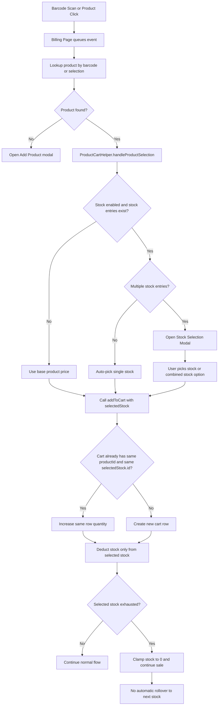
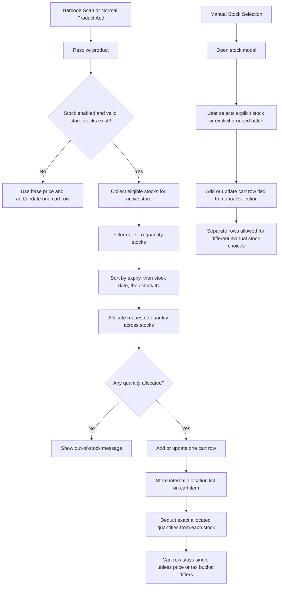

# Multi-Stock Review

_Last updated: 2026-03-30_

This document reviews the current multi-stock behavior in billing and barcode scan flows, explains where the current logic is correct or risky, and proposes a better stock allocation model for production POS use.

---

## 1. Goal

The billing flow should answer these questions correctly:

- When should the same product stay in a single cart row?
- When should the same product appear in multiple rows?
- How should quantity be consumed when a product has multiple stock entries?
- What should happen during repeated barcode scans?

The recommended answer is:

- **Normal add / barcode scan:** keep a single cart row and allocate quantity across stocks automatically.
- **Manual batch choice by cashier:** allow separate rows by selected stock.
- **Different selling price / tax bucket:** separate rows are acceptable.

---

## 2. Current Behavior Summary

### 2.1 Barcode Processing

- Barcode scans are queued and processed one at a time.
- The billing page resolves the barcode to matching products.
- If products are found, the first matching product is sent to the centralized add-to-cart helper.

This means the current code does **not** have an obvious parallel-processing race that would create duplicate rows from the same scan event.

### 2.2 Cart Row Identity

The cart currently merges rows using:

- `productId`
- `selectedStock.id`

So:

- Same product + same stock ID -> quantity increases on the same row.
- Same product + different stock ID -> a second row can appear.

### 2.3 Multi-Stock Handling Today

When stock management is enabled and a product has multiple stock entries:

- The helper opens the stock selection modal.
- The user chooses a stock option.
- The cart item is tied to that selected stock identity.
- Stock deduction happens only against that selected stock.

If that stock runs out:

- quantity is clamped at `0`
- the sale can continue
- the system does **not** automatically move remaining quantity to the next stock entry

### 2.4 Important Caveat: Combined Stock Modal

The stock modal groups stock entries that share the same pricing fields.

That grouped option:

- shows a combined total quantity
- but returns the **first stock ID** as the selected stock identity

This is important because the UI may present something that looks like one combined stock pool, while the backend deduction logic still anchors the cart item to one stock identity.

---

## 3. Current Flow Diagram



---

## 4. Current Logic Review

## What is correct today

- Barcode events are serialized, which reduces accidental duplicate add calls.
- Cart merging by `productId + stockId` is internally consistent.
- Manual stock selection can legitimately create multiple rows.
- Single-stock products behave predictably.

## What is risky today

### 4.1 Auto-consumption across multiple stocks is missing

Example:

- Stock A: qty 10
- Stock B: qty 10
- Cashier scans 15 units

Expected POS behavior:

- one cart row with qty 15
- 10 deducted from stock A
- 5 deducted from stock B

Current behavior:

- deduction remains tied to the selected stock only
- when that stock reaches zero, deduction is clamped
- remaining quantity is not automatically consumed from the next stock

### 4.2 Combined stock presentation can mislead the flow

When the modal combines stocks with matching price/MRP/unit, the cashier may see a single option with total quantity, but the cart item still comes back with one underlying stock ID. That creates a mismatch between:

- what the UI suggests
- how stock is actually deducted

### 4.3 Row identity is too tightly coupled to deduction identity

The current model uses one selected stock both for:

- cart row identity
- inventory deduction

Those are not always the same business concern.

---

## 5. Recommended Logic

The correct production logic should split the problem into two modes.

### 5.1 Automatic Allocation Mode

Use this for:

- barcode scan
- product click
- autocomplete selection
- quick add

Behavior:

- keep one cart row by default
- allocate quantity across eligible stocks automatically
- choose stocks using a defined priority order

Recommended priority order:

1. earliest expiry date
2. oldest stock date
3. lowest stock ID as fallback

### 5.2 Manual Stock Selection Mode

Use this only when the cashier explicitly wants to choose a batch or stock entry.

Behavior:

- user chooses a specific stock entry or explicit grouped batch
- cart row remains tied to that manual choice
- selecting another stock later can create a separate row

This gives a clean rule:

- **automatic path:** one row, internal multi-stock allocation
- **manual path:** separate rows allowed

---

## 6. Recommended Flow Diagram



---

## 7. Recommended Data Model

The current model stores a single `selectedStock` on the cart item. That is not enough for automatic multi-stock allocation.

Recommended model:

```dart
class CartStockAllocation {
  final int stockId;
  num quantity;

  CartStockAllocation({
    required this.stockId,
    required this.quantity,
  });
}

class LocalCartItem {
  final GetProduct product;
  num quantity;
  double? price;
  double? mrp;

  // Optional for explicit manual stock choice UI
  final Stock? selectedStock;

  // Required for correct inventory handling
  final List<CartStockAllocation> allocations;
}
```

### Why this is better

- `selectedStock` can remain a UI concept for explicit stock selection.
- `allocations` becomes the real source of truth for inventory deduction and restoration.
- decrement, clear cart, and remove item can restore stock precisely.

---

## 8. Allocation Rules

## Automatic add rule

For barcode and normal add flows:

1. fetch valid stocks for active store
2. sort by allocation priority
3. consume quantity across stocks until request is satisfied or stock ends
4. add or update a single cart row
5. store per-stock allocations on that row

Pseudo-flow:

```text
requestedQty = 15
stocks = [stock1:10, stock2:10]

allocations = []

for stock in stocks:
  take = min(stock.quantity, requestedQty)
  if take > 0:
    allocations.add(stock.id, take)
    requestedQty -= take
  if requestedQty == 0:
    break

fulfilledQty = sum(allocations)

if fulfilledQty == 0:
  show out-of-stock
else:
  add/update cart row with qty = fulfilledQty
  deduct each allocation from its stock
  if requestedQty > 0:
    optionally show partial stock warning
```

## Manual add rule

For explicit stock selection:

- use only the chosen stock or explicit chosen grouped batch
- tie row identity to that manual selection
- allow a second row when a different stock is manually chosen

---

## 9. Cart Row Merge Rules

### Automatic allocation items should merge by

- product ID
- effective sell price
- tax bucket
- relevant modifiers such as comment or variant, if applicable

### Manual stock-selected items should merge by

- product ID
- selected stock ID
- effective sell price
- tax bucket

This prevents duplicate-looking rows in normal scanning while preserving explicit batch control.

---

## 10. Recommended Behavior for Common Cases

### Case A: single-stock product

- repeated barcode scans should stay in one row
- quantity increases normally

### Case B: multi-stock product, same price, no manual selection

- repeated scans should stay in one row
- stock should be consumed across entries automatically

### Case C: multi-stock product, cashier manually selects stock 1 then stock 2

- separate rows are valid
- each row represents an explicit stock choice

### Case D: multi-stock product, stocks have different selling prices

- separate rows are acceptable even in automatic logic
- because selling value differs

---

## 11. Implementation Impact in This Codebase

The main areas that need change are:

- `lib/helpers/product_cart_helper.dart`
- `lib/providers/local_product_provider.dart`
- `lib/widgets/stock_selection_modal.dart`

### 11.1 `product_cart_helper.dart`

Should stop forcing one selected stock as the only deduction source for normal barcode and quick-add flows.

Instead:

- normal flow -> call automatic allocator
- manual stock modal flow -> call explicit stock path

### 11.2 `local_product_provider.dart`

Should support:

- storing allocation lists on cart items
- deducting/restoring stock using allocations
- merging automatic rows without requiring a single stock ID match

### 11.3 `stock_selection_modal.dart`

Should be clear about whether the user is choosing:

- one exact stock entry
- or one combined stock pool

If combined pools remain in UI, they should return enough data to allocate correctly across all source stocks, not only the first stock ID.

---

## 12. Migration Strategy

To reduce risk, implement in stages.

### Stage 1

- keep current UI
- add stock allocation support to cart item model
- update add/remove/decrement/clear-cart logic to use allocations

### Stage 2

- change barcode and normal add flows to automatic allocation mode
- keep manual modal behavior for explicit batch selection

### Stage 3

- improve stock modal wording and data return shape
- remove misleading combined-stock behavior that returns only the first stock identity

### Stage 4

- add targeted tests for:
  - repeated barcode scans
  - multi-stock allocation across two batches
  - manual stock selection creating separate rows
  - stock restoration on item removal and clear cart

---

## 13. Final Recommendation

For POS billing, the correct business behavior is:

- **Default behavior:** one row per product in normal barcode and quick-add flows, with quantity allocated across stocks automatically.
- **Explicit batch control:** separate rows only when the cashier intentionally selects different stock entries.
- **Inventory accuracy:** use per-stock allocation records, not a single selected stock field, as the real deduction source.

This change will make billing behavior more intuitive for operators and more accurate for stock accounting.