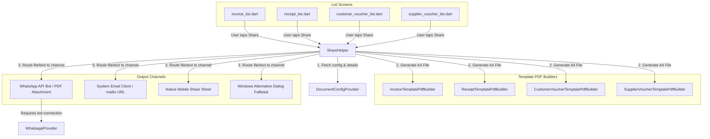

# Dynamic PDF Generation & Sharing Implementation

This document describes the design, architecture, and implementation details of the unified PDF generation and multi-channel sharing system in the application. It outlines the role of the `ShareHelper` component, the dynamic HTML/PDF template builder system, and how the platform-specific sharing constraints (particularly on Windows) are handled.

---

## 1. Architectural Overview

The PDF sharing architecture is built to centralize sharing logic across list views (Invoices, Receipts, Customer Vouchers, and Supplier Vouchers) while allowing dynamic styling through customizable document templates.



---

## 2. Core Components

### A. Central Share Controller: `ShareHelper`
Located at [`lib/screens/transactions/widgets/share_helper.dart`](file:///c:/Users/Mubashir/eposmob/lib/screens/transactions/widgets/share_helper.dart), this helper contains static entry points for each transaction type:
* `showShareInvoiceSheet`
* `showShareReceiptSheet`
* `showShareCustomerVoucherSheet`
* `showShareSupplierVoucherSheet`

Each method displays a customized `BottomSheet` with three primary sharing channels: **Share as PDF**, **Share to Email**, and **Share via WhatsApp**.

#### Why Separate Share Methods for Each Document Type?
Rather than using a single unified "generic" share handler, the system implements dedicated methods for Invoices, Receipts, and Vouchers. This is driven by several key technical and design requirements:

1. **Distinct Data Models & Compile-Time Type Safety:**
   Each document type depends on a completely different model structure:
   * Invoices require `InvoiceDetails` (with customer info, itemized grids, taxes, and terms).
   * Receipts require `lr.Receipt` (with payment references and methods).
   * Customer/Supplier Vouchers require their respective ledger and payment account data models.
   Dedicated methods enforce compile-time checks, preventing runtime type matching issues.

2. **Custom Document Templates & Configurations:**
   Each document loads layout definitions from the backend using different template config types (`Invoice` maps to `type: 'default'`, whereas `Receipt` maps to `type: 'receipt'`, etc.). Separating these methods simplifies parameter maps and config retrieval.

3. **Different Communication Contexts & Templates:**
   * **Subject and Message Formatting:** Email and message text dynamically change depending on the document type (e.g., invoice reminders vs. payment receipts vs. voucher adjustments).
   * **Sharing Channel Payloads:** Invoices send a web URL link via WhatsApp (allowing the customer to view/pay the invoice online), whereas Receipts and Vouchers generate the PDF file locally and attach it directly via WhatsApp.

### B. PDF Document Template Builders
Located under [`lib/screens/transactions/widgets/pdf_builders/`](file:///c:/Users/Mubashir/eposmob/lib/screens/transactions/widgets/pdf_builders/), these builders construct custom A4 PDF documents. They integrate layout definitions, dynamic tables, totals calculation, and accents fetched from document settings:

| Builder File Name | Purpose | Generated Document Layout |
| :--- | :--- | :--- |
| [invoice_template_pdf_builder.dart](file:///c:/Users/Mubashir/eposmob/lib/screens/transactions/widgets/pdf_builders/invoice_template_pdf_builder.dart) | Generates standard invoices | A4 PDF, metadata blocks, itemized grid, tax, totals, terms. |
| [receipt_template_pdf_builder.dart](file:///c:/Users/Mubashir/eposmob/lib/screens/transactions/widgets/pdf_builders/receipt_template_pdf_builder.dart) | Generates payment receipts | A4 PDF with payment method details, referencing transaction IDs. |
| [customer_voucher_template_pdf_builder.dart](file:///c:/Users/Mubashir/eposmob/lib/screens/transactions/widgets/pdf_builders/customer_voucher_template_pdf_builder.dart) | Generates customer account vouchers | Account summary statement, voucher balance, and payment references. |
| [supplier_voucher_template_pdf_builder.dart](file:///c:/Users/Mubashir/eposmob/lib/screens/transactions/widgets/pdf_builders/supplier_voucher_template_pdf_builder.dart) | Generates supplier account vouchers | Vendor summary details, amount credit/debit adjustments, and history. |

---

## 3. Dynamic Branding & Customization

The PDF builders pull design systems dynamically from the API via `DocumentConfigProvider`:
1. **Accent Color:** Uses the backend custom accent hex code (e.g., `#1E88E5`) to color table headers, banner panels, and borders.
2. **Template Type:** Renders layout schemas based on active template definitions (`classic`, `modern`, etc.).
3. **Store Detail injection:** Injects location metadata, currency symbols, and business registration IDs fetched from the active `StoreSessionProvider`.

---

## 4. Multi-Channel Routing Details

### 1. Share as PDF
* Generates a temporary local `.pdf` file.
* Invokes `SharePlus` to trigger the platform's native share controller.
* Automatically includes platform checks to bypass limitations on Windows (see Section 5).

### 2. Share to Email
* Formats a structured text summary.
* Generates a link matching public web routes: `${APPUrl.baseURL}/<type>/<docNumber>`.
* Constructs a `mailto:` URI scheme using `url_launcher` to load the desktop or mobile native mail app.

### 3. Share via WhatsApp
* **Status Check:** Verifies if the local WhatsApp bot gateway is active (`WhatsappProvider.isWhatsAppAvailable()`). If not connected, it prompts the user with a dialog redirecting to the WhatsApp settings scanner.
* **Payload:** For invoices, it sends an interactive message containing the URL. For receipts and vouchers, it calls `whatsappProvider.sendPDFFile(...)` to transmit the generated PDF file as a native attachment.

---

## 5. Platform Compatibility & Windows Fallback

> [!WARNING]
> **Windows OS System Share Issue**
> The native Windows Share Sheet (`WinRT` share contract) requires an active packaged application environment with registered destination apps (like Outlook or UWP Mail). In standard unpackaged Win32/Flutter environments (e.g., during development or unpackaged local run), invoking `SharePlus` causes Windows to crash or show the error dialog:
> *"Try that again. We couldn't show you all the ways you could share."*

To solve this, `ShareHelper` implements an alternative share dialogue when running on Windows desktop.

### How the Windows Fallback Works

```dart
if (Platform.isWindows) {
  try {
    final enhancedXFile = XFile(
      pdfFile.path,
      name: 'Invoice_$invoiceNumber.pdf',
      mimeType: 'application/pdf',
      length: await pdfFile.length(),
    );
    final params = ShareParams(files: [enhancedXFile]);
    final result = await SharePlus.instance.share(params);

    if (result.status == ShareResultStatus.success) {
      debugPrint('Windows file sharing succeeded!');
    } else {
      _handleWindowsAlternativeSharing(context, pdfFile, invoiceNumber);
    }
  } catch (e) {
    _handleWindowsAlternativeSharing(context, pdfFile, invoiceNumber);
  }
}
```

If sharing fails or is dismissed, `_handleWindowsAlternativeSharing` opens a clean dialog presenting three desktop fallback options:

1. **Open File Location:** Opens a native File Explorer window focusing on the saved PDF location.
   ```dart
   await Process.start(
     'explorer.exe',
     ['/select,', pdfFile.path.replaceAll('/', '\\')],
     mode: ProcessStartMode.detached,
   );
   ```
2. **Open PDF:** Launches the PDF in the user's default PDF viewer (e.g., Adobe Reader, Chrome).
   ```dart
   await Process.start(
     'cmd',
     ['/c', 'start', '""', pdfFile.path],
     mode: ProcessStartMode.detached,
   );
   ```
3. **Copy Path:** Copies the full local file path to the clipboard (`Clipboard.setData`) for easy manual attachment.

---

## 6. Integration Checklist

When invoking the share features from new lists or modules:

1. **Import `ShareHelper`:**
   ```dart
   import 'widgets/share_helper.dart';
   ```
2. **Retrieve Customer Details:**
   Ensure the invoice/receipt model includes the customer name, phone number, and email. Provide empty strings or nulls as a fallback.
3. **Trigger Controller:**
   Call the corresponding sheet:
   ```dart
   await ShareHelper.showShareInvoiceSheet(
     context: context,
     invoiceId: invoice.id,
     invoiceNumber: invoice.invoiceNumber,
     customerName: invoice.customer.user.name,
     customerPhone: invoice.customer.user.phone,
     customerEmail: invoice.customer.user.email,
     amount: invoice.amount,
   );
   ```
