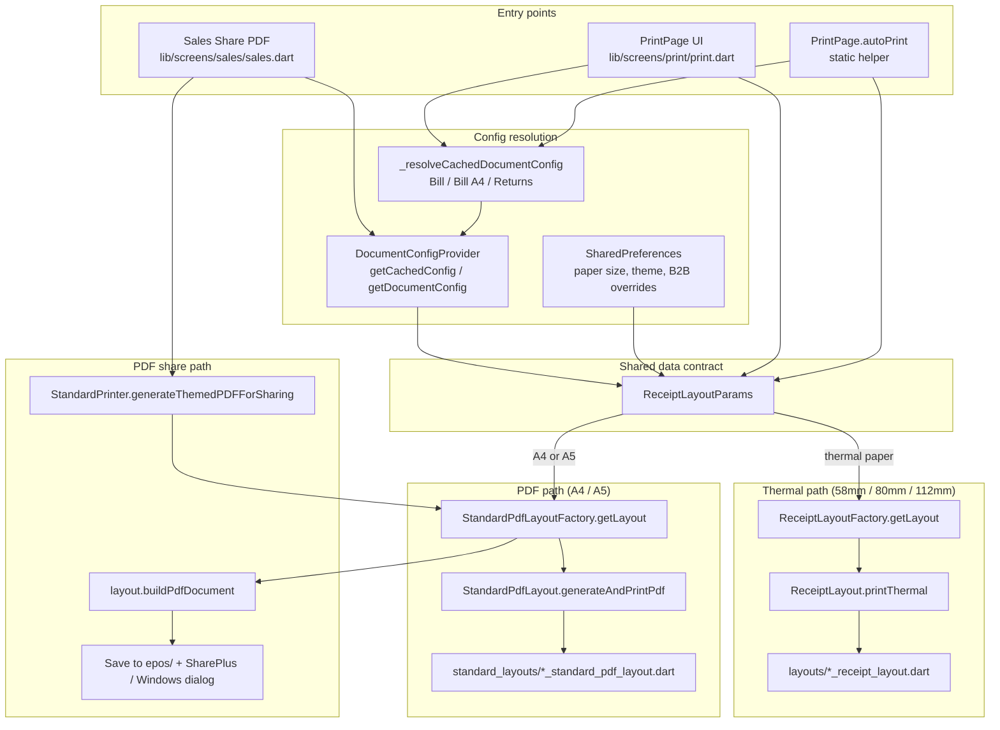

# Print Template Architecture Guide

> **Audience:** Interns and new contributors working on bill printing, PDF sharing, or document templates in the eposmob Flutter app.
>
> **Purpose:** This document explains how bill print **actually works today** (ground truth from the codebase), corrects misconceptions in `proposed_template_sharing_architecture.md`, and gives a concrete checklist for adding new templates correctly.

---

## 1. Purpose

The intern proposal (`proposed_template_sharing_architecture.md`) correctly identified the business need — client-side PDFs that respect store document configuration — but proposed **new abstractions that largely duplicate what already exists**:

| Proposed (does not exist) | What the codebase already has |
|---|---|
| `ShareInvoiceHelper` | Inline methods in `sales.dart` / `sales_order_details.dart` (`_sharePDFInvoice`) |
| `ReusablePdfTemplateBuilder` | `StandardPdfLayoutFactory` + per-theme classes in `standard_layouts/` |
| New config cache layer | `DocumentConfigProvider` (Hive + SharedPreferences + logo cache) |

**Do not build parallel systems.** Extend the existing factory pattern, shared params object, and share entry point.

---

## 2. How Bill Print Works Today

### High-level flow



### Step-by-step (print flow)

1. **Caller opens print or triggers auto-print** — `PrintPage` widget or `PrintPage.autoPrint(...)`.
2. **Document config is resolved from cache** (no API call during print) via `_resolveCachedDocumentConfig`, which picks the right Hive key based on paper size, returns, and optional `documentConfigType`.
3. **Theme is resolved** — local SharedPreferences override API `activeTheme`, defaulting to `classic`.
4. **`ReceiptLayoutParams` is built** — one object carrying cart items, customer info, ZATCA credentials, bank details, `billDocumentConfig`, etc.
5. **Route by paper size:**
   - `58mm` / `80mm` / `112mm` → `ReceiptLayoutFactory.getLayout(theme).printThermal(params)`
   - `A4` / `A5` → `StandardPdfLayoutFactory.getLayout(theme).generateAndPrintPdf(params)`

### Step-by-step (share flow — Sales orders only today)

1. User taps **Share as PDF** in `sales.dart` or `sales_order_details.dart`.
2. Order details are fetched from the API.
3. Config is resolved with `_resolvePdfBillDocumentConfig` → prefers `"Bill A4"` then `"Bill"`.
4. `StandardPrinter.generateThemedPDFForSharing(...)` builds `ReceiptLayoutParams`, resolves B2B billing prefs, coerces thermal paper sizes to `A4`, then calls `StandardPdfLayoutFactory.getLayout(theme).buildPdfDocument(params)`.
5. PDF bytes are saved under `Documents/epos/Invoice_<orderNumber>.pdf`.
6. Platform-specific share: `SharePlus` on mobile; custom dialog on Windows (native share sheet is unreliable for unpackaged Win32 builds).

### Theme resolution priority

```dart
// print.dart — manual / auto print
localTheme = prefs[billing_receipt_theme_b2b | billing_receipt_theme | quotation_receipt_theme]
  ?? billDocumentConfig.activeTheme
  ?? 'classic'

// print_standard.dart — share PDF
theme = prefs[billing_receipt_theme_b2b]
  ?? prefs[billing_receipt_theme]
  ?? billDocumentConfig.activeTheme
  ?? 'classic'
```

Local device settings **win over** the API theme. This is intentional — store staff can override the web dashboard theme per device.

---

## 3. Key Files & Responsibilities

| File / folder | Role |
|---|---|
| `lib/screens/print/print.dart` | Main print UI, `autoPrint`, config resolution (`_resolveCachedDocumentConfig`), B2B routing, thermal vs PDF dispatch |
| `lib/screens/print/print_standard.dart` | Legacy monolithic PDF builder (`StandardPrinter`), `generateThemedPDFForSharing`, Arabic fonts, ZATCA QR in classic PDF |
| `lib/providers/document_config_provider.dart` | Fetch + Hive cache + logo download; `getCachedConfig(type)` for instant print |
| `lib/screens/print/layouts/receipt_layout_params.dart` | **Shared data contract** for all layouts (thermal + PDF) |
| `lib/screens/print/layouts/receipt_layout.dart` | Abstract thermal/PDF interface: `printThermal`, `buildPdf` |
| `lib/screens/print/layouts/receipt_layout_factory.dart` | Maps `activeTheme` → thermal layout class |
| `lib/screens/print/layouts/*_receipt_layout.dart` | Per-theme thermal implementations (image-based ESC/POS) |
| `lib/screens/print/thermal/sections/` | Reusable section builders (header, items, totals, QR, footer) |
| `lib/screens/print/standard_layouts/standard_pdf_layout.dart` | Abstract A4/A5 interface: `generateAndPrintPdf`, `buildPdfDocument` |
| `lib/screens/print/standard_layouts/standard_pdf_layout_factory.dart` | Maps `activeTheme` → PDF layout class |
| `lib/screens/print/standard_layouts/*_standard_pdf_layout.dart` | Per-theme PDF implementations |
| `lib/screens/print/logo_loader.dart` | Logo fetch with local cache via `DocumentConfigProvider.getCachedLogoFilePath` |
| `lib/screens/print/receipt_customer_segment.dart` | B2B vs B2C customer detection |
| `lib/screens/sales/sales.dart` | Sales list share-PDF flow (`_sharePDFInvoice`, Windows fallback dialog) |
| `lib/models/document_configurations.dart` | `DocumentConfig` model (`activeTheme`, `displayConfiguration`, `resolvedLabels`) |

---

## 4. What Already Exists (Don't Rebuild)

### DocumentConfigProvider

- Fetches all configs from `/api/v1/document/document-configs` on login/sync.
- Persists each config to Hive keyed by type name (e.g. `"Bill"`, `"Bill A4"`).
- `getCachedConfig(type)` / `getDocumentConfig(type)` — same method, used synchronously at print time.
- `fetchDocumentConfigByTypeAndLanguage(type:, language:)` — on-demand fetch with `?type=bill&language=ar`.
- `cacheDocumentLogosLocally()` + `getCachedLogoFilePath(url)` — offline logo support.

### Factory pattern (both thermal and PDF)

```dart
// Thermal
final layout = ReceiptLayoutFactory.getLayout(theme);
await layout.printThermal(params);

// PDF print
final layout = StandardPdfLayoutFactory.getLayout(theme);
await layout.generateAndPrintPdf(params);

// PDF share
final pdf = await layout.buildPdfDocument(params);
```

Unknown themes fall back to `classic` in both factories.

### ReceiptLayoutParams

Already handles:

- B2B invoice title override (`showInvoiceTitleB2B`)
- RTL / bilingual language from `billDocumentConfig.language`
- ZATCA credential checks (`hasZatcaCredentials`)
- Multi-payment breakdown resolution
- Bank detail lines, tax totals, returns

**New templates should read from `params`, not re-fetch config or re-parse customer type.**

### generateThemedPDFForSharing

`StandardPrinter.generateThemedPDFForSharing` in `print_standard.dart` is the **canonical share entry point** for Sales orders. All share buttons should route through it (they mostly do today).

### Registered themes (current)

**Thermal** (`ReceiptLayoutFactory`):

`classic`, `premium`, `premium1`, `premium2`, `standard`, `arabic_and_english`, `arabic_english_table_headers`, `arabic_and_english_3`, `supermarket`, `supermarket2`, `supermarkerrecpt3`, `bilingual`, `multi_store`

**PDF** (`StandardPdfLayoutFactory`):

`classic`, `tax_invoice`, `detailed_tax_invoice`, `standard_tax_invoice`, `new_classic`, `simplified_tax_invoice`, `corporate_tax_invoice`, `letterhead_tax_invoice`

---

## 5. What's Missing / Gaps

| Gap | Impact | Notes |
|---|---|---|
| **Invoice module share** | Transactions → Invoice list has no client-side themed PDF share | Uses server PDF / ZATCA endpoints; `InvoiceDetails` model is separate from `OrderDetailsModelData` |
| **`ClassicStandardPdfLayout.buildPdfDocument` returns empty PDF** | Share with `classic` theme produces 0-byte file | Delegates print to `StandardPrinter.generateAndPrintPDF` but `buildPdfDocument` returns `pw.Document()` — must migrate classic PDF building logic |
| **Duplicated share boilerplate** | `sales.dart` and `sales_order_details.dart` each have ~150 lines of identical fetch → generate → share logic | Candidate for `DocumentPdfShareService` |
| **Config resolution duplicated** | `_resolveCachedDocumentConfig` in `print.dart` vs `_resolvePdfBillDocumentConfig` in `sales.dart` | Slightly different fallback chains; should be one resolver |
| **Legacy `invoice_pdf.dart`** | Hardcoded A5 PDF, ignores document config entirely | Old demo screen, not production share path |
| **Thermal themes lack `buildPdf`** | Only relevant if you ever share thermal-sized output as PDF | Share path coerces to A4 anyway |

---

## 6. Revised Plan (What to Do Instead)

The intern proposal's *intent* is right; the *implementation path* should follow existing patterns.

### A. Extend factories — do not add parallel abstractions

```
❌  ShareInvoiceHelper + ReusablePdfTemplateBuilder
✅  StandardPdfLayoutFactory + ReceiptLayoutFactory + ReceiptLayoutParams
```

When adding Invoice-module sharing, build an **adapter** that maps `InvoiceDetails` → `ReceiptLayoutParams`, then call the same factory.

### B. DocumentPdfShareService (new, thin)

Extract the repeated flow from `sales.dart`:

```dart
// Proposed shape — not yet in codebase
class DocumentPdfShareService {
  Future<void> shareOrderPdf(BuildContext context, {required String orderNumber});
  Future<void> shareInvoicePdf(BuildContext context, {required int invoiceId});
}
```

Responsibilities only:

1. Show loading UI
2. Fetch transaction data
3. Resolve config via shared resolver
4. Call `generateThemedPDFForSharing` (or a generalized `generateDocumentPdf`)
5. Platform share (including Windows fallback)

### C. document_config_resolver.dart (new, extracted)

Move and unify:

- `PrintPage._resolveCachedDocumentConfig` (print.dart ~line 386)
- `_resolvePdfBillDocumentConfig` (sales.dart ~line 82)

Into one function with explicit parameters:

```dart
DocumentConfig? resolveDocumentConfig({
  required DocumentConfigProvider provider,
  required DocumentKind kind,      // bill, billA4, returnBill, invoice, voucher, ...
  String? paperSize,               // A4, A5, 80mm, ...
});
```

### D. InvoiceDetails → ReceiptLayoutParams adapter

`InvoiceDetails` (`lib/models/invoice_details.dart`) has a different shape than order cart items. Create:

```dart
ReceiptLayoutParams fromInvoiceDetails(
  BuildContext context,
  InvoiceDetails invoice,
  DocumentConfig config,
  { /* store + app settings */ },
);
```

Map `invoiceItems` to the `cartItems` structure layouts already expect (name, qty, price, tax).

### E. Phased rollout

| Phase | Scope | Deliverable |
|---|---|---|
| **1** | Fix classic share gap | Implement `ClassicStandardPdfLayout.buildPdfDocument` (extract from `StandardPrinter`) |
| **2** | DRY share flow | `DocumentPdfShareService` + migrate `sales.dart` / `sales_order_details.dart` |
| **3** | Unified config | `document_config_resolver.dart`; replace inline resolvers |
| **4** | Invoice module | `InvoiceDetails` adapter + share from `invoice_list.dart` using `type=default` / cache key `Invoice` |
| **5** | Other docs | Voucher, Delivery Note, Customer Statement — one resolver case + optional new layout per theme |

---

## 7. How to Add a New Print Template

### New thermal theme

1. **Create layout class** in `lib/screens/print/layouts/`:

   ```dart
   class MyThemeReceiptLayout implements ReceiptLayout {
     @override String get layoutId => 'my_theme';
     @override String get displayName => 'My Theme';

     @override
     Future<void> printThermal(ReceiptLayoutParams params) async { /* ... */ }

     @override
     Future<pw.Document> buildPdf(ReceiptLayoutParams params) async { /* optional */ }
   }
   ```

2. **Register in factory** — `receipt_layout_factory.dart`:

   ```dart
   'my_theme': () => MyThemeReceiptLayout(),
   ```

3. **Reuse thermal sections** where possible — import from `thermal/sections/sections.dart` (`HeaderSection`, `CartItemsSection`, `QrCodeSection`, etc.).

4. **Respect display config** — gate every visible element on `params.displayConfig?['showXxx']?.visible` and use `params.billDocumentConfig.resolvedLabels` for column headers.

5. **Set theme on backend** — store owner selects theme in web dashboard; API returns `active_theme: "my_theme"`.

6. **Test** via Printer Settings → theme dropdown (local override) and PrintPage with 80mm paper.

### New PDF theme (A4 / A5)

1. **Create layout class** in `lib/screens/print/standard_layouts/` implementing `StandardPdfLayout`.

2. **Implement both methods:**
   - `generateAndPrintPdf` — build, save to `epos/`, open (Windows) or `OpenFile` (mobile)
   - `buildPdfDocument` — return `pw.Document` **without** side effects (required for sharing)

   Follow `simplified_tax_invoice_standard_pdf_layout.dart` as the reference implementation.

3. **Register in** `standard_pdf_layout_factory.dart`:

   ```dart
   'my_pdf_theme': () => MyPdfThemeStandardPdfLayout(),
   ```

4. **Handle A4 vs A5:**

   ```dart
   final isA5 = params.selectedPaperSize.toUpperCase() == 'A5';
   final pageFormat = isA5 ? PdfPageFormat.a5 : PdfPageFormat.a4;
   ```

5. **Load logo** via `PrintLogoLoader.loadPdfLogo(url)` — never fetch raw URLs without cache lookup.

6. **Verify share path** — `generateThemedPDFForSharing` calls `buildPdfDocument`, not `generateAndPrintPdf`.

### Wire document config

On the backend / API, ensure:

- `active_theme` matches your factory key (lowercase)
- `display_configuration` toggles are present for every optional section
- `resolved_labels` provides column header text
- `language` is set (`en`, `ar`, or `bilingual`) for RTL behavior

---

## 8. Config Resolution Rules

### Cache keys vs API `?type=` parameter

The Hive cache is keyed by the **human-readable type name** returned in the API response (`document_configurations` map keys), not always the `?type=` query value.

| Document | API `?type=` (for `fetchDocumentConfigByTypeAndLanguage`) | Typical cache key(s) | Used by |
|---|---|---|---|
| Bill (thermal) | `bill` | `Bill` | `print.dart` when paper is 58/80/112mm |
| Bill (A4/A5) | `bill` | `Bill A4` → fallback `Bill` | `print.dart`, `sales.dart` share |
| Sales + Return | `sales_and_return_bill` | `Sales and Return Bill A4` → `Sales and Return Bill` | Orders with return items |
| Kitchen Order | — | `Kitchen Order` | `print_kot.dart` |
| Voucher | — | `Voucher` | `customer_voucher_print.dart` |
| Supplier Voucher | — | `Supplier Voucher` | `supplier_voucher_print.dart` |
| Customer Statement | — | `Customer Statement` | Transaction reports |
| Invoice (proposed) | `default` | `Invoice` | Not wired in mobile share yet |

### Resolution logic in print.dart

```dart
// Simplified from _resolveCachedDocumentConfig
if (paperSize is A4/A5 && type == 'bill')
  → Bill A4 → bill_a4 → bill-a4 → Bill

if (hasReturns && paperSize is A4/A5)
  → Sales and Return Bill A4 → Sales and Return Bill

if (hasReturns && thermal)
  → Sales and Return Bill

if (paperSize is A4/A5)
  → Bill A4 → Bill

else (thermal, no returns)
  → Bill
```

### B2B routing

When customer is a business (`ReceiptCustomerSegment.isBusiness`):

- Separate printer prefs: `default_printer_b2b`, `default_paper_size_b2b`, `billing_receipt_theme_b2b`
- Falls back to B2C keys if B2B not configured
- `ReceiptLayoutParams.displayConfig` swaps `showInvoiceTitle` for `showInvoiceTitleB2B`

---

## 9. Common Pitfalls

### RTL and Arabic shaping

- Thermal layouts use Flutter `TextDirection` and `ArabicPrinterHelper`.
- PDF layouts must set `textDirection: pw.TextDirection.rtl` on Arabic `pw.Text` widgets — the `pdf` package only shapes Arabic glyphs when direction is RTL. See `_autoText` / `_dirOf` in `simplified_tax_invoice_standard_pdf_layout.dart`.
- Load `NotoSansArabic-Regular.ttf` / `Bold` from assets for PDF Arabic text.

### ZATCA QR code

- Credentials come from `SharedPreferenceProvider` (`zatcaVatNumber`, `zatcaCompanyName`), not document config.
- `ZatcaQrHelper` builds TLV QR data; layouts check `params.hasZatcaCredentials`.
- Payment gateway fallback exists in standard PDF layouts when ZATCA creds are missing.

### B2B preferences

- Share flow **always reads B2B billing prefs first** (`billing_receipt_theme_b2b`), even for B2C customers. This matches "B2B Billing Printer" settings in Printer Settings.
- Print flow respects B2B segment per order via `_isB2BForDocument`.

### Windows share

- `share_plus` native sheet returns `unavailable` on unpackaged Win32 builds.
- `sales.dart` → `_handleWindowsAlternativeSharing` shows a dialog: open in Explorer, open with default app, copy path.
- Any new share service must include this Windows branch.

### A4 vs A5

- Selected in Printer Settings (`default_paper_size` / `_b2b` variant).
- Layouts must read `params.selectedPaperSize` and set `PdfPageFormat` accordingly.
- Share path coerces 58/80/112mm → `A4` because share output is always an A-series PDF.

### Classic theme share bug

If users select `classic` theme and share PDF, they may get an empty file because `ClassicStandardPdfLayout.buildPdfDocument` returns an empty document. **Phase 1 of the revised plan fixes this.**

### Don't call the API during print

Print uses `getCachedConfig` for speed. Config must be pre-loaded at login via `fetchDocumentConfigurations`. If cache is empty, print fails with "Document configuration not loaded."

### Cart item shape

Layouts accept `List<dynamic>` — items may be `Map` (offline/local storage) or typed API objects. Always handle both:

```dart
if (params.isFromLocalStorage || item is Map) {
  // item['productName'], item['quantity'], ...
} else {
  // item.productName, item.quantity, ...
}
```

---

## 10. Quick Reference: Code Anchors

**Config resolution (print):**

```386:425:lib/screens/print/print.dart
  static DocumentConfig? _resolveCachedDocumentConfig(
    DocumentConfigProvider docConfigProvider, {
    String? documentConfigType,
    required bool hasReturns,
    String? paperSize,
  }) {
    // ... Bill A4 / Returns / Bill fallback chain
  }
```

**Thermal vs PDF dispatch:**

```284:292:lib/screens/print/print.dart
      if (paperSize == '112mm' || paperSize == '80mm' || paperSize == '58mm') {
        final layout = ReceiptLayoutFactory.getLayout(theme);
        await layout.printThermal(params);
      } else {
        final standardLayout = StandardPdfLayoutFactory.getLayout(theme);
        await standardLayout.generateAndPrintPdf(params);
      }
```

**Share PDF generation:**

```2720:2731:lib/screens/print/print_standard.dart
      final layout = StandardPdfLayoutFactory.getLayout(theme);
      final pdf = await layout.buildPdfDocument(params);
      // ... save to epos/Invoice_<orderNumber>.pdf
```

**Classic layout empty PDF gap:**

```64:73:lib/screens/print/standard_layouts/classic_standard_pdf_layout.dart
  Future<pw.Document> buildPdfDocument(ReceiptLayoutParams params) async {
    // For now, return an empty document.
    return pw.Document();
  }
```

---

## 11. Further Reading

- `proposed_template_sharing_architecture.md` — intern's original proposal (superseded by this guide for implementation decisions)
- `lib/screens/print/standard_layouts/simplified_tax_invoice_standard_pdf_layout.dart` — best reference for a complete PDF theme
- `lib/screens/print/layouts/classic_receipt_layout.dart` — best reference for thermal theme structure
- Printer Settings UI — where local theme/paper size overrides are stored

---

*Last updated: July 2026. If you change factory registrations or config keys, update this document.*
