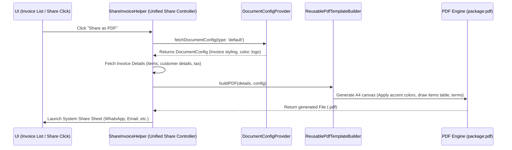

# Proposed Architecture: Reusable Client-Side PDF Template Generator

This document outlines the proposed design to build a **Reusable Document PDF Generator** in the mobile app. The architecture maps configuration settings from the `document-configs` API dynamically into localized, high-fidelity PDF documents.

---

## 1. Background & Problem Statement
The app needs to support sharing professional PDF formats (Invoices, Bills, Receipts, Vouchers) directly from the mobile device. 

* **The Challenge:** The server-rendered template download endpoints require an `invoiceHash` (which only exists on Orders, not on Invoice module objects), or return a basic receipt layout that doesn't respect the design configuration set by the store owner on the web dashboard.
* **The Solution:** Fetch the styling rules (colors, logos, table labels, terms) from the `/api/v1/document/document-configs` API, and render the PDF document **client-side** in Flutter using a reusable generation engine.

---

## 2. API Parameter Mapping
We query the `document-configs` API using the specific template option keys for filtering:

| Document Type | API Parameter (`?type=...`) | Config Key in Cache | Theme Styles |
| :--- | :--- | :--- | :--- |
| **Invoice** | `default` | `Invoice` | Custom accent colors, table, Billed To/From |
| **Bill** | `bill` | `Bill` | Store details toggles, tax/MRP visibility |
| **Receipt** | `receipt` | `Receipt` | Header/subheader headers, payment method lines |
| **Voucher** | `voucher` | `Voucher` | Simple debit/credit balance receipts |
| **Delivery Note** | `delivery_note` | `Delivery Note` | Signatures, remarks columns |

---

## 3. Reusable Architecture Diagram

---

## 4. Architectural Components

### A. The Configuration Cache Layer (`DocumentConfigProvider`)
Acts as the single source of truth for template configs.
* Fetches the dynamic JSON settings from the server.
* Toggles settings (e.g. `show_logo`, `show_description`).
* Downloads and caches store logos locally so they can be loaded offline.

### B. The Sharing Controller (`ShareInvoiceHelper`)
A clean, centralized widget that manages:
1. Fetching the layout configuration from cache.
2. Fetching the transaction details (items, prices, customers).
3. Invoking the layout builder.
4. Launching native share trays (WhatsApp, Mail, or native file explorer).

### C. The Layout Builder (`ReusablePdfTemplateBuilder`)
The rendering engine that translates API rules into canvas coordinates:
* **Color Resolver:** Parses hex colors (`accent_color: "#5b5cff"`) dynamically.
* **Label Resolver:** Maps columns dynamically (`config.resolvedLabels.itemName` or falls back to standard fields).
* **Table Styler:** Standardizes clean horizontal list grids.
* **Logo Resolver:** Automatically loads local cache file paths using `DocumentConfigProvider.getCachedLogoFilePath()`.

---

## 5. Next Steps for Implementation
1. **Filter Query Fix:** Change the API parameter query in `ShareInvoiceHelper` for Invoices to target `type: 'default'` instead of `type: 'Invoice'`.
2. **Unified PDF Factory:** Standardize all templates (Bill A4, Quotations, Statements) under a single reusable PDF builder class to clean up the `standard_layouts` folder.
