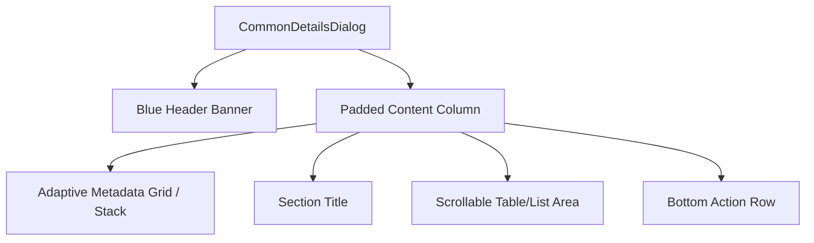

# CommonDetailsDialog Reusable Component Documentation

This document explains the technical details, architecture, design constraints, and implementation choices of the reusable modal dialog system developed to standardise detail views (Receipts, Expenses, and general transactions) across the application.

---

## 1. Core Objectives & Problem Statement
Previously, modal details dialogs were implemented on a screen-by-screen basis (e.g., in receipt lists, invoice lists, and expenses). This approach had several critical drawbacks:
* **Code Duplication:** Standard styles, fonts, columns, and headers were redefined in multiple widgets.
* **Inconsistent Aesthetics:** Small variations in column paddings, heading box shapes, and text sizes led to a fragmented user experience.
* **Mobile Overflows:** Flat inline `Row` layouts forced key-value pairs to squeeze horizontally, causing pixel overflow warnings on narrow viewports.
* **Misaligned Values:** Values started immediately after text labels of varying lengths, creating a jagged, hard-to-read vertical layout.

---

## 2. Reusable Architecture
The solution introduces a unified widget: **`CommonDetailsDialog`** inside [common_details_dialog.dart](file:///c:/Users/Mubashir/eposmob/lib/screens/transactions/widgets/common_details_dialog.dart).



### Component Definition & Parameters
The widget accepts the following data parameters to remain generic:
* **`title`** (`String`): The main title displayed inside the top header banner (e.g., `"Receipt payment details"`).
* **`gridColumns`** (`List<List<Widget>>`): A nested list representing columns. Each inner list contains a collection of key-value pair rows.
* **`sectionTitle`** (`String?`, optional): An optional section divider title (e.g., `"Payments"`).
* **`tableContent`** (`Widget?`, optional): A table or list view that lists transactional item items.
* **`extraActions`** (`List<Widget>?`, optional): Additional action buttons placed alongside the default "Close" button.

---

## 3. Pixel-Perfect Design Decisions

### A. Full-Bleed Header Block
To make the modal look premium, the blue header spans the entire top edge of the dialog:
* Set parent padding of the container to `EdgeInsets.zero`.
* Added a child `Container` with the primary color (`ColorManager.kPrimaryColor`) and top vertical rounded corners (`BorderRadius.vertical(top: Radius.circular(16))`) matching the main dialog shape.
* Positioned a white Close `X` button on the far right of this header, inside the Row, with an increased font size (`FontSize.s22`) for the heading.

### B. Vertical Alignments (Table-Like Keys)
To match the high readability of the Product Details page:
* Key-value rows are constructed via `buildKeyValueRow(String label, String value)`.
* Every label is wrapped inside a `SizedBox` with a fixed width of **`160px`**.
* This forces all values (e.g. `RCP1000456`, `FUNZCART`, `1950.000`) to line up along a single vertical line, significantly improving readability.

### C. Adaptive Grid Layout (Responsive Stacking)
To prevent horizontal overflow issues on small devices (tablets, mobiles):
* We query `screenWidth = MediaQuery.of(context).size.width` and evaluate `isNarrow = screenWidth < 650`.
* **Wide Screens (Desktop/Tablet):** Grid columns render side-by-side inside a `Row`, dividing the space equally (`Expanded`).
* **Narrow Screens (Mobile):** The grid columns collapse into a single stacked `Column` (`gridColumns.expand()`). Because the stacked layout uses full dialog width, the `160px` labels never overflow.

### D. Bottom-Docked Button Alignment
To ensure the Close button is always anchored at the bottom-right corner of the dialog:
* Re-enforced a minimum dialog height constraint (`minHeight: 480`) to keep a consistent visual weight.
* Wrapped the dialog scroll body inside an **`Expanded`** container (instead of `Flexible`).
* By making the body `Expanded`, the viewport bounds are strictly set to fill all remaining height, naturally pushing the close button row to the bottom edge of the dialog while preventing nested scrollable viewport collapses.

---

## 4. Usage Examples in Transaction Modules

### A. Receipt List Modal (`receipt_list.dart`)
In [receipt_list.dart](file:///c:/Users/Mubashir/eposmob/lib/screens/transactions/receipt_list.dart), we call `CommonDetailsDialog` to display general receipt metadata along with an optional listing table representing individual payment items:

```dart
void _showReceiptDetails(Receipt receipt) {
  showDialog(
    context: context,
    builder: (context) => CommonDetailsDialog(
      title: 'Receipt payment details',
      gridColumns: [
        [
          CommonDetailsDialog.buildKeyValueRow('Receipt Number', receipt.receiptNumber),
          CommonDetailsDialog.buildKeyValueRow('Customer', receipt.customer.user.name),
          CommonDetailsDialog.buildKeyValueRow('Amount', receipt.amount),
        ],
        [
          CommonDetailsDialog.buildKeyValueRow('Company', receipt.company.name),
          CommonDetailsDialog.buildKeyValueRow('Status', receipt.receiptStatus),
          CommonDetailsDialog.buildKeyValueRow('Payment reference', receipt.paymentReference),
        ],
      ],
      sectionTitle: 'Payments',
      tableContent: Column(
        children: [
          // Table Header
          Container(
            padding: const EdgeInsets.symmetric(vertical: 8, horizontal: 8),
            decoration: BoxDecoration(
              border: Border(bottom: BorderSide(color: Colors.grey.shade200, width: 1)),
            ),
            child: Row(
              children: [
                Expanded(flex: 3, child: Text('Date', style: headerStyle)),
                Expanded(flex: 3, child: Text('Invoice', style: headerStyle)),
                Expanded(flex: 2, child: Text('Method', style: headerStyle)),
                Expanded(flex: 2, child: Text('Amount', style: headerStyle, textAlign: TextAlign.right)),
              ],
            ),
          ),
          // Table Rows
          ...receipt.receiptPayments.map((p) => Container(...)).toList(),
        ],
      ),
    ),
  );
}
```

### B. Invoice List Modal (`invoice_list.dart`)
In [invoice_list.dart](file:///c:/Users/Mubashir/eposmob/lib/screens/transactions/invoice_list.dart), `CommonDetailsDialog` is instantiated without a sub-table, cleanly demonstrating how the component handles metadata-only configurations:

```dart
void _showInvoiceDetails(Invoice invoice) {
  showDialog(
    context: context,
    builder: (context) => CommonDetailsDialog(
      title: 'Invoice details',
      gridColumns: [
        [
          CommonDetailsDialog.buildKeyValueRow('Invoice Number', invoice.invoiceNumber),
          CommonDetailsDialog.buildKeyValueRow('Customer Name', invoice.customer.user.name),
          CommonDetailsDialog.buildKeyValueRow('Customer Phone', invoice.customer.user.phone),
          CommonDetailsDialog.buildKeyValueRow('Amount', invoice.amount.toString()),
          CommonDetailsDialog.buildKeyValueRow('Type', invoice.type),
        ],
        [
          CommonDetailsDialog.buildKeyValueRow('Invoice Date', invoice.invoiceDate),
          CommonDetailsDialog.buildKeyValueRow('Due Date', invoice.dueDate),
          CommonDetailsDialog.buildKeyValueRow('Status', invoice.status),
          CommonDetailsDialog.buildKeyValueRow('Order Number', 'N/A'),
        ],
      ],
    ),
  );
}
```

---

## 5. Code Snapshot & Implementation Reference
Refer to the current implementation inside:
* [common_details_dialog.dart](file:///c:/Users/Mubashir/eposmob/lib/screens/transactions/widgets/common_details_dialog.dart)

This clean layout system ensures that future modals added to the application can instantly reuse this widget, guaranteeing consistent look and feel across modules.

