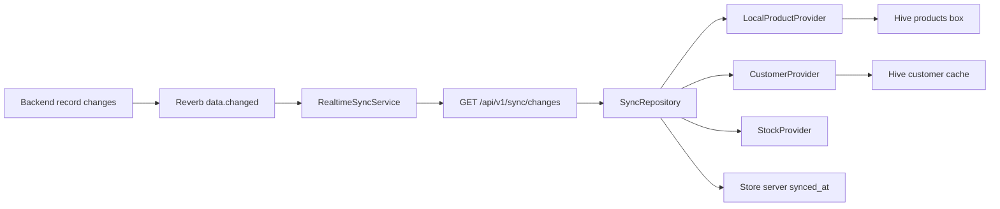

# Flutter POS Real-Time Sync — App Implementation Plan

This document converts the backend contract in
[`pos-flutter-realtime-sync-plan.md`](pos-flutter-realtime-sync-plan.md) into an
implementation plan for this Flutter POS application.

The backend is treated as fixed for the first release. Because the current
Flutter app has no confirmed bulk fetch-by-ID endpoints, a change notification
will use the existing product delta and customer/stock refresh APIs.

---

## 1. Goals

- Receive product, customer, and stock change notifications from Laravel
  Reverb.
- Use WebSocket events only as notifications, then pull authoritative changes
  from `GET /api/v1/sync/changes`.
- Keep the product Hive cache and Provider state synchronized.
- Recover changes missed while the app is offline, backgrounded, or
  disconnected.
- Isolate synchronization by company and active store.
- Prevent real-time and manual sync operations from writing local data
  concurrently.
- Protect active-cart prices and stock reservations when server data changes.
- Roll out behind a feature flag until testing against the development backend
  is complete.

## 2. Non-goals for the first release

- No Laravel/backend code changes.
- No dependency on receiving every WebSocket event.
- No record data will be trusted directly from a socket event.
- No replacement of the existing manual `SyncProvider`.
- No new local database technology; continue using Hive and
  SharedPreferences.
- No `connectivity_plus` dependency; reuse
  `internet_connection_checker_plus`.

---

## 3. Current app integration points

The app already stores the values needed by the real-time service:

- `api_key`: company/tenant key used as `X-Tenant`.
- `access_token`: bearer token required by existing data endpoints.
- `company_id`: used to construct the private Reverb channel.
- `active_store_id`: used to scope local data and API refreshes.
- `APPUrl.baseURL`: dynamically resolved tenant backend URL.

Relevant existing components:

- `lib/resources/app_url.dart`: tenant backend URL and endpoint definitions.
- `lib/providers/shared_preferences.dart`: session, company, store, and current
  product sync values.
- `lib/providers/local_product_provider.dart`: product catalog, billing stock,
  cart reservations, and product Hive persistence.
- `lib/providers/customer_provider.dart`: customer directory and store-scoped
  Hive cache.
- `lib/providers/stock_provider.dart`: inventory-screen stock state.
- `lib/providers/sync_provider.dart`: manual full, section, and row sync.
- `lib/providers/store_session_provider.dart`: active-store bootstrap.
- `lib/services/session_reset_service.dart`: logout and API-key reset.
- `lib/main.dart`: app-scoped Provider registration and lifecycle host.

The real-time service must start only after login and store bootstrap. It must
not start from `main()` before the API key, company, access token, and selected
store are available.

---

## 4. Data flow



Example:

1. Product `4242` is edited in the backend.
2. Reverb sends `data.changed`.
3. Flutter waits approximately 500 ms to combine burst events.
4. Flutter calls `/api/v1/sync/changes?since=<last-server-cursor>`.
5. The response reports product `4242` as upserted.
6. Flutter runs its existing strict product delta refresh.
7. `LocalProductProvider` updates memory and Hive.
8. Flutter waits for Hive persistence to finish.
9. Flutter saves the response's `synced_at` value.
10. Widgets listening to `LocalProductProvider` rebuild.

If the socket event is missed, the next startup, reconnect, internet restore, or
app resume performs the same catch-up pull.

---

## 5. New files

Create the following directory and files:

```text
lib/sync/
  sync_config.dart
  sync_models.dart
  sync_api.dart
  last_sync_store.dart
  reverb_client.dart
  sync_operation_gate.dart
  sync_repository.dart
  realtime_sync_service.dart
```

### 5.1 `sync_config.dart`

Responsibilities:

- Read the public Reverb app key.
- Resolve the Reverb host, port, and TLS setting.
- Read `REALTIME_SYNC_ENABLED`.
- Use the current mutable `APPUrl.baseURL` when no Reverb host override is
  configured.
- Validate configuration before opening a connection.

Configuration values:

```text
REALTIME_SYNC_ENABLED=false
REVERB_APP_KEY=<public app key>
REVERB_HOST=<optional override>
REVERB_PORT=8081
REVERB_USE_TLS=true
```

Rules:

- Never include `REVERB_APP_SECRET` in Flutter.
- Production should use `wss`.
- The WebSocket implementation must not inherit the app's permissive HTTP
  certificate override.
- The feature must remain disabled if required configuration is missing.

### 5.2 `sync_models.dart`

Add immutable models for:

- Pusher connection-established data.
- Reverb `data.changed` notification.
- Per-entity upserted/deleted ID sets.
- `/sync/changes` response and `synced_at`.
- Sync status and typed sync failures.

The raw socket event name is:

```text
data.changed
```

The leading `.data.changed` form is Laravel Echo syntax and must not be used
when matching raw Pusher protocol frames.

### 5.3 `sync_api.dart`

Use an injectable `http.Client`.

Responsibilities:

1. Authorize the private channel:

   ```text
   POST {APPUrl.baseURL}/api/broadcasting/auth
   X-Tenant: <api_key>
   Content-Type: application/json

   {
     "socket_id": "<socket-id>",
     "channel_name": "private-company.<company-id>.sync"
   }
   ```

2. Pull the authoritative change list:

   ```text
   GET {APPUrl.baseURL}/api/v1/sync/changes?since=<encoded-server-cursor>
   X-Tenant: <api_key>
   ```

3. Parse and distinguish:

   - invalid tenant/API key;
   - channel authorization failure;
   - expired access token from subsequent record APIs;
   - timeout or temporary network failure;
   - malformed backend response.

Add `broadcastAuth` and `syncChanges` getters to
`lib/resources/app_url.dart`.

### 5.4 `last_sync_store.dart`

Persist a separate server cursor for each company and store:

```text
realtime_sync_cursor_<companyId>_<storeId>
```

Rules:

- Store only the backend response's `synced_at`.
- Never generate the cursor from the device clock.
- Do not reuse `last_product_sync_iso`; its semantics are different.
- Save the cursor only after every required Provider update and Hive write
  completes successfully.
- Clear or replace the active cursor when the company or store changes.

### 5.5 `reverb_client.dart`

Use `web_socket_channel` and implement only the required Pusher protocol.

Sequence:

1. Open:

   ```text
   ws(s)://<host>:<port>/app/<app-key>?protocol=7&client=flutter&version=1.0
   ```

2. Parse `pusher:connection_established`.
3. Extract `socket_id`.
4. Request private-channel authorization from `SyncApi`.
5. Send `pusher:subscribe`.
6. Wait for `pusher_internal:subscription_succeeded`.
7. Emit typed notifications for `data.changed`.

Also implement:

- reply to `pusher:ping` with `pusher:pong`;
- activity timeout handling;
- socket close/error handling;
- capped exponential reconnect backoff;
- subscription/auth error reporting;
- idempotent connect and disconnect;
- complete stream/subscription cleanup on disposal.

The client must not know about Provider, Hive, widgets, products, customers, or
stock.

### 5.6 `sync_operation_gate.dart`

Provide one synchronization lock shared by:

- the real-time sync service;
- manual row/section/all operations in `SyncProvider`.

Behavior:

- allow only one local data refresh operation at a time;
- do not run real-time and manual sync writes concurrently;
- if a socket event arrives while synchronization is active, schedule exactly
  one follow-up catch-up pull;
- reject stale operations after logout or store switch.

### 5.7 `sync_repository.dart`

Convert the `/sync/changes` response into Provider refresh operations.

First-release strategy:

| Changed entity | Flutter action |
|---|---|
| Products | Strict product delta refresh using the requested server time window |
| Customers | Full customer-directory refresh through the existing endpoint |
| Stocks | Full inventory stock refresh plus reservation-safe product refresh |
| Deleted products | Apply `deleted_product_ids` returned by the existing product endpoint |
| Deleted customers/stocks | Remove them through the refreshed authoritative lists |

The IDs from `/sync/changes` are used as entity-level signals in this release.
They are not yet used for direct per-ID fetches because the required bulk
endpoints are not confirmed.

The repository must:

- use the shared operation gate;
- fail the complete operation if a required entity refresh fails;
- await product Hive persistence;
- check that the company/store generation is still current before applying
  results;
- save `synced_at` only after the complete operation succeeds.

### 5.8 `realtime_sync_service.dart`

Responsibilities:

- perform catch-up after store bootstrap;
- connect and subscribe to Reverb;
- debounce notification bursts for approximately 500 ms;
- prevent overlapping pulls;
- coalesce notifications received during an active pull;
- reconnect with backoff;
- catch up after successful resubscription;
- catch up after internet restoration;
- catch up when the app returns to the foreground;
- stop and invalidate work on logout, API-key reset, or store switch.

Expose idempotent operations:

```dart
Future<void> start(...);
Future<void> catchUp();
Future<void> pause();
Future<void> resume();
Future<void> stop();
```

Use a generation token so a response started for Store A cannot update Provider
state after the user switches to Store B.

---

## 6. Existing Provider changes

### 6.1 `LocalProductProvider`

Add a strict real-time refresh path separate from the current best-effort UI
refresh.

Requirements:

- Use an explicit server window for `updated_at_range`.
- If no local baseline or cursor exists, perform a full product refresh.
- Throw on failed pages, partial responses, or parsing errors.
- Merge products by `productId`.
- Apply `deleted_product_ids`.
- Rebuild filters, pagination, and barcode indexes once per batch.
- Persist changes to Hive.
- Await `flushPersistence()` before reporting success.
- Notify listeners once after the complete local operation.

Do not save a new product or real-time cursor after only some pages succeed.

### 6.2 `CustomerProvider`

Add a strict full-directory replacement method for real-time synchronization.

Requirements:

- Replace `_allCustomers` for the active store.
- Reapply current filters and pagination.
- Persist the new directory into `customer_cache`.
- Refresh the selected customer when it still exists.
- Clear the selected customer when it was deleted.
- Notify listeners once.
- Throw on API, parsing, or cache-write failure.

### 6.3 `CustomerSelectionProvider`

Add reconciliation operations to:

- replace the selected customer after an upsert;
- clear the selected customer after deletion;
- avoid keeping a stale customer snapshot in billing.

### 6.4 `StockProvider`

Add a strict full-list replacement method.

Requirements:

- Replace inventory-screen `_allStocks`.
- Rebuild filtered and paginated state.
- Notify listeners once.
- Do not clear or overwrite `pending_stock_items`.
- Throw on API or parsing failure.

The app currently registers `StockProvider` twice in `main.dart`. Remove the
duplicate before injecting it into the real-time repository so the service and
UI use the same instance.

---

## 7. Cart and stock correctness

This is the highest-risk application-specific area.

`LocalProductProvider` currently subtracts stock immediately when an item is
added to the cart and stores per-stock reservations. A server refresh can
replace that reduced quantity with the authoritative server quantity. If the
cart later restores its reservation, local stock can become artificially
inflated.

For every authoritative stock update:

```text
displayed available quantity
    = authoritative server quantity
    - active local cart reservations
```

Rules:

- Reconcile using `stockReservations`, not only `selectedStock`.
- Support cart lines that reserve multiple grouped/FEFO stock rows.
- Preserve a cart line's agreed price when a product price changes remotely.
- Preserve manual price overrides.
- Do not silently delete a cart line when its product or stock is deleted.
- Mark a deleted or unavailable reserved item as conflicted and block checkout
  until the user resolves it.
- Do not restore a reservation twice after a server refresh.
- Persist the reconciled product and cart snapshots in one ordered operation.

---

## 8. App lifecycle wiring

### Start after store bootstrap

Update `StoreSessionProvider.bootstrapStore()`:

1. Save and activate the selected store.
2. Load settings, customers, categories, and products as it does now.
3. Finish the local baseline.
4. Start the real-time service.
5. Perform one catch-up pull.
6. Connect and subscribe to Reverb.

Do not start the service immediately after `AuthModel.login()` because the
active store is not known at that point.

### Store switch

Before changing `active_store_id`:

1. Stop the current socket.
2. Increment the sync generation to invalidate in-flight operations.
3. Wait for safe local persistence to finish.
4. Clear/bootstrap the new store's data.
5. Start with the new company/store cursor.
6. Catch up and reconnect.

### Logout and API-key reset

At the beginning of `SessionResetService`:

1. Stop the real-time service.
2. Cancel socket subscriptions and timers.
3. Invalidate in-flight pull results.
4. Wait for pending local writes.
5. Then clear credentials, store state, and caches.

Normal logout should also reset `StoreSessionProvider` so stale active-store
state does not remain in the root Provider tree.

### App background and resume

Add one app-scoped `WidgetsBindingObserver` host under `MultiProvider`.

- On `paused` or `detached`: pause/close the socket without clearing the cursor.
- On `resumed`: verify that the user and store are still valid, reconnect,
  resubscribe, and perform a catch-up pull.

Do not depend on billing-page lifecycle handlers because those handlers exist
only while a particular route is mounted.

### Internet restoration

Reuse `BillingProvider`/`internet_connection_checker_plus`.

- Initialize connectivity monitoring at app scope.
- Observe effective `hasInternet`, including manual offline mode.
- On a transition from offline to online, reconnect and catch up.
- Socket close/error remains authoritative because a connectivity probe does
  not guarantee that Reverb is reachable.

---

## 9. Status and error handling

Track these service states:

```text
disabled
stopped
connecting
authorizing
subscribed
syncing
waitingToRetry
configurationError
authenticationError
```

Logging rules:

- Log connection state and entity change counts.
- Log company/store IDs only when useful for diagnostics.
- Never log the API key, bearer token, channel auth signature, or Reverb secret.
- Treat broadcast-auth `403` and invalid tenant responses as terminal until the
  credentials/store change.
- Retry socket and temporary network failures with capped backoff.
- Do not advance the server cursor after any partial failure.

---

## 10. Dependency and configuration changes

### `pubspec.yaml`

Add `web_socket_channel` as a direct dependency. It currently exists only as a
transitive dependency and should not be relied on that way.

No new connectivity package is required.

### Release configuration

After development verification, pass the public Reverb values and feature flag
through the existing release scripts and workflows:

- `.github/workflows/release.yml`
- `.github/workflows/android-release.yml`
- `.github/workflows/release-linux.yml`
- `.github/workflows/publish-store.yml`
- `.github/workflows/build-msix-manual.yml`
- `build-installer.ps1`
- `build-msix.ps1`
- `scripts/release.ps1`

Keep `REALTIME_SYNC_ENABLED=false` by default until integration QA passes.

---

## 11. Test plan

Create:

```text
test/sync/
  sync_config_test.dart
  sync_models_test.dart
  sync_api_test.dart
  last_sync_store_test.dart
  reverb_client_test.dart
  sync_operation_gate_test.dart
  sync_repository_test.dart
  realtime_sync_service_test.dart
  realtime_sync_lifecycle_test.dart
```

### Unit tests

Cover:

- connection-established parsing;
- nested JSON in Pusher `data`;
- private-channel auth and subscribe frames;
- raw `data.changed` event matching;
- ping/pong;
- subscription/auth errors;
- reconnect backoff and disposal;
- URL encoding and `X-Tenant` headers;
- malformed sync responses;
- company/store cursor isolation;
- server cursor never generated from device time;
- 500 ms event debounce;
- one in-flight pull;
- exactly one queued follow-up pull;
- stale-generation rejection;
- cursor not advancing on API, Provider, or Hive failure;
- customer selected-state reconciliation;
- stock reservation rebasing;
- manual/realtime sync mutual exclusion.

### Integration tests against the development backend

1. Start Reverb and the Laravel queue worker.
2. Select a store and complete app bootstrap.
3. Edit one product and verify the billing catalog updates.
4. Edit several products rapidly and verify a debounced catch-up.
5. Add/update/delete a customer and verify the directory and selection state.
6. Update and soft-delete stock and verify inventory and billing quantities.
7. Disconnect the socket, make several changes, reconnect, and verify all are
   recovered.
8. Background and resume the app.
9. Toggle airplane mode or network connectivity.
10. Run manual Sync All while Reverb events arrive.
11. Switch stores while a pull is in progress.
12. Update stock for a product reserved in the active cart and verify no stock
    inflation or double restoration.

### Verification commands

After implementation:

```text
dart format <edited Dart files>
flutter test test/sync
flutter test
flutter analyze
```

---

## 12. Implementation milestones

- [ ] M1 — Add configuration, models, endpoint definitions, `SyncApi`, and
  company/store-scoped cursor storage.
- [ ] M2 — Add strict product/customer/stock refresh operations and cart
  reservation reconciliation.
- [ ] M3 — Implement `SyncRepository` and the shared manual/realtime operation
  gate; verify manual catch-up without WebSockets.
- [ ] M4 — Implement Reverb connect, auth, private subscription, ping/pong, and
  event stream.
- [ ] M5 — Wire event debounce, reconnect, startup catch-up, internet restore,
  app resume, store switch, and session teardown.
- [ ] M6 — Add automated tests and complete development-backend QA.
- [ ] M7 — Add release configuration and enable the feature for a controlled
  rollout.

---

## 13. Acceptance criteria

The work is complete when:

- The app subscribes to `private-company.<companyId>.sync`.
- `data.changed` causes an authoritative catch-up pull.
- Product, customer, and stock screens update without a manual refresh.
- Changes made while disconnected are recovered.
- Cursors are isolated by company and active store.
- The cursor advances only after all local changes are durable.
- Store switches and logout cannot apply stale in-flight responses.
- Manual and real-time syncs cannot write concurrently.
- Active cart prices and reservations remain correct after remote updates.
- No credentials or Reverb secret appear in logs or client configuration.
- Automated tests and development-backend scenarios pass.

## Future optimization

When the backend exposes confirmed bulk fetch-by-ID endpoints, update
`SyncRepository` to fetch only the records listed by `/sync/changes`. The
WebSocket client, cursor store, lifecycle handling, and orchestration can remain
unchanged; only the entity-refresh strategy needs to become more granular.
